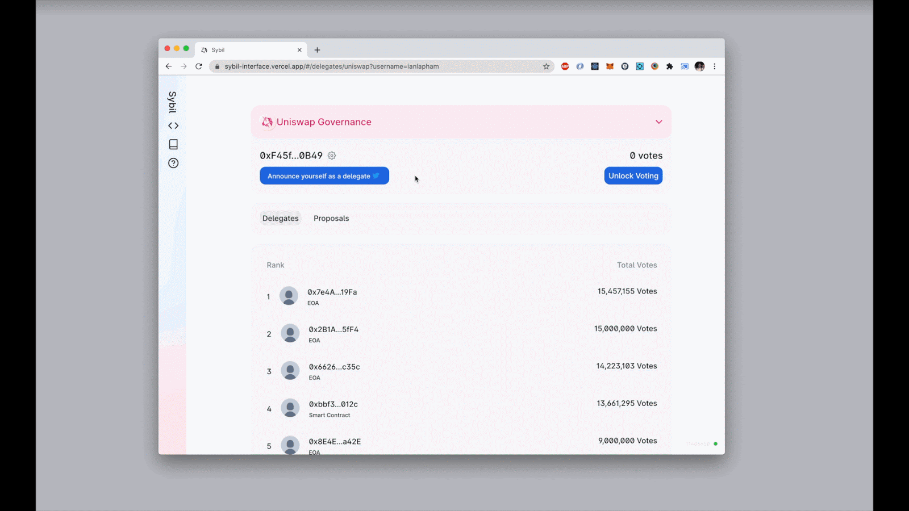

Today we're excited to introduce **[Sybil](https://sybil.org/), a governance tool for discovering delegates.** Sybil **maps on-chain addresses to digital identities** to maintain a list of delegates, all while avoiding pesky user signups, on-chain transactions, and manual record keeping.

We hope that Sybil can grow adoption of Uniswap's governance system and encourage both existing and future Uniswap delegates to verify their identities, **making it easier for delegators to discover and engage with their community representatives**.

## The importance of delegation

Experimentation with on-chain governance systems continues to gain popularity, and for good reason! Community ownership reduces single points of failure and as protocols begin to develop into products that resemble legacy services — albeit in a structurally decentralized fashion — they naturally require good management.

The ability for token holders to delegate their votes, or to stand as a delegate themselves, is key to the success of on-chain governance systems, allowing for high quality community members to build meaningful influence and otherwise-marginalized token holders to engage in a representative fashion. We believe that **the most successful protocols will be the ones that are able to attract the best talent and the most engaged communities.**

Yet as an emerging primitive, delegation-based governance systems are still gaining some important infrastructure. Sybil's purpose is to provide a simple way for governance token holders to identify their community representatives, and in doing so grow engagement in the protocol's development process.

## How it works

The Sybil verification flow is a three step process.

1. Users sign into Twitter and connect a Web3 wallet
2. Users sign a message that includes their Twitter handle using their private key
3. Users then tweet this message from their Twitter account

In the background, Sybil verifies that the tweet content matches the signed message. Once a user has been verified, their Twitter handle is matched to their Ethereum address and will appear on the Sybil interface next to their associated vote count. Sybil users can proceed to **review available delegates, as well as delegate or vote on governance proposals directly through the interface.**

## Extending Sybil

At launch, Sybil supports both Uniswap and Compound's delegate lists but it's mapping tool can be used to display public identities for any project.

Identities work cross-platform, so users will only ever need to go through Sybil verification once per identity. For now, Sybil is solely integrated with Twitter, although the architecture allows for any other service to act as an authentication method: GitHub integration is coming soon!

Sybil's use cases extend beyond delegation. The mapping of addresses to social identities can be leveraged for features like trading and gaming leaderboards, as well as Ethereum-based messaging.

Similarly, the Sybil verification process is not constrained to the Sybil.org interface. The documentation below provides detailed steps for both supporting the Sybil verification process directly from your existing interface and running custom verification flows around list creation.

## Get involed

- [Verify yourself as a delegate on Sybil.org](https://sybil.org/)

- [Use the Sybil list](https://github.com/Uniswap/sybil-list#use-the-sybil-list)

- [Verify your own list](https://github.com/Uniswap/sybil-list#verify-your-own-list)

- [Contribute to the Sybil interface](https://github.com/Uniswap/sybil-interface)
