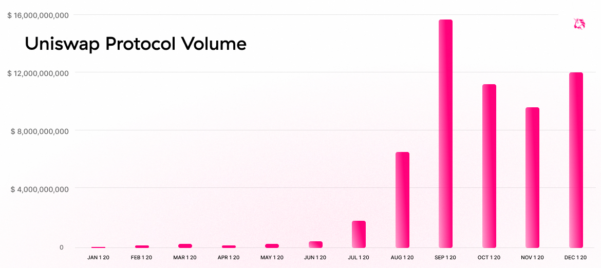
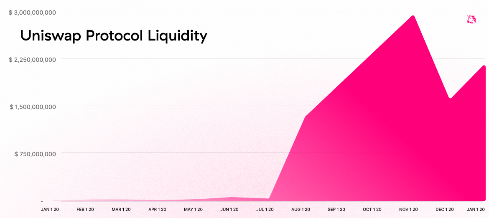
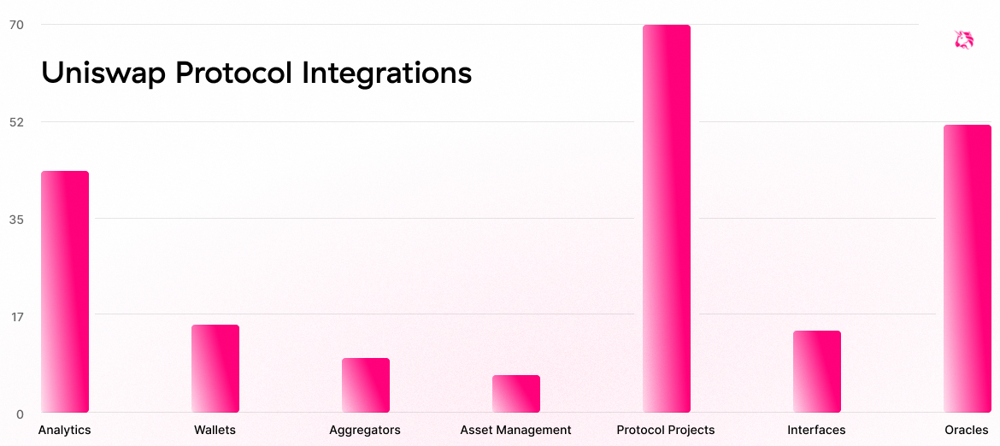

2020 was a breakout year for the Uniswap protocol. As it comes to a close, we wanted to review some key accomplishments from the past 12 months and share some insight into our roadmap for the coming year.

# 2020 Review:

### V2 launch introduces new primitives and efficiency gains:

- [Uniswap v2](https://uniswap.org/blog/uniswap-v2/) launched in May, bringing support for arbitrary ERC20/ERC20 pairs, robust time weighted average price oracles, flash swaps, and significant architecture improvements.

- Flash swaps have generated $4.8bn volume since May, producing $14.4m in liquidity provider fees.

- Uniswap's TWAP implementation continues to see adoption as key oracle infrastructure, counting [integrations](https://debank.com/ranking/oracle?chart_date=1Y) across over 50 protocols including Compound, Augur v2, and Empty Set Dollar — second only to Chainlink.

- While ETH remains the dominant pair numeraire, Uniswap v2 supports over 4,400 non-ETH pairs, including 7 of the 25 most liquid pairs at the time of this post.

### Volumes surge to new heights:

- The Uniswap protocol supported more than **\$58bn** volume over the course of 2020, up **15,000%** from \$390m in 2019.

- In September, the protocol briefly surpassed Coinbase on weekly volumes. Today, Uniswap is the 5th largest venue for crypto spot trading in the world.

- The protocol has averaged over 54% volume market share among trading protocols since January.

### Uniswap's liquidity rivals that of centralized counterparts:

- The Uniswap protocol currently commands over $2bn in liquidity, up 17,000% from $12m at the start of the year.

- Over 68,000 unique addresses are currently providing liquidity across 27,000 unique trading pairs.

### Users gravitate towards decentralized trading:

- The protocol's MAU figures have grown month-on-month since the launch of v2, with December surpassing 300k unique addresses.

- Uniswap trades regularly account for 25% of Ethereum network transactions.

- Meanwhile, the protocol's median trade size in 2020 was just \$634.

### Uniswap as neutral, robust exchange infrastructure:

- Uniswap now counts over 200 integrations across protocols, data analytics services, advanced interfaces, wallets, and more.

- Highlights include Uniswap LP shares serving as collateral in MakerDAO; Uniswap flash loans being used for execution in Aave v2 collateral swaps, and Fireblock's integration of Uniswap into its institutional-focused DeFi API.

### Christmas comes early with UNI token:

- As part of the launch of Uniswap's governance token, 150 million UNI — accounting for 15% of supply and currently worth approximately \$630 million — was distributed to historical users and liquidity providers.

- An additional 20 million UNI were distributed to liquidity providers between September 16 and November 16.

- Over 110,000 addresses currently hold UNI, making UNI one of the most widely distributed tokens on Ethereum.

### Uniswap's governance brings the protocol closer to self-sustainability:

- Uniswap governance counts roughly 5,000 unique delegates and 6,000 unique delegators, including active participation from many of the crypto community's leading ambassadors.

- The Uniswap [community treasury](https://etherscan.io/address/0x1a9c8182c09f50c8318d769245bea52c32be35bc) currently holds over 47m UNI, which can be distributed through votes by token holders on a discretionary basis.

- The first successful governance proposal [was executed](https://etherscan.io/tx/0x1348b107d951b7ceeb7d934f463d5f862464ff93988e73f3d8052f358fa2411c) on December 27th, establishing a [grants program](https://gov.uniswap.org/t/rfc-uniswap-grants-program-v0-1/9081/32) to invest in the ecosystem's future.

### Token Lists improves ERC20 discoverability:

- In August, the Uniswap team launched [Token Lists](http://tokenlists.org/), a community standard for creating lists of ERC20 tokens.

- [Token Lists](https://uniswap.org/blog/token-lists/) improve discoverability and trust in ERC20s in a manner that is inclusive, transparent, and decentralized.

- Token Lists has emerged as the industry standard for off-chain token discovery and counts support from industry-leading firms, including Coingecko, Coinmarketcap Messari, Set Protocol, Kleros, and Wrapped.com, and has been integrated into projects including Matcha.

### Sybil makes delegating easy:

- In December, the Uniswap team launched [Sybil](http://sybil.org/), a cross-platform tool for improving the discoverability of governance delegates

- [Sybil](https://uniswap.org/blog/sybil/) uses third party authentication platforms (Twitter, GitHub etc.) and digital signatures to map Ethereum addresses to digital identities.

- Sybil-verified identities work cross-platform: Sybil supports Compound governance out of the box.

## 2021 Roadmap:

### Improve automated market making:

- The Uniswap team continues to research and develop market leading AMM technology, making considerable progress on v3.

- V3's design is driven by a desire to drastically improve the AMM experience for both swappers and LPs, increasing capital efficiency and flexibility while introducing superior execution.

### Explore scaling solutions:

- Scaling solutions present a path to lower latency trading, faster settlement, and cheaper transaction costs.

### Emphasis on governance:

- Uniswap's long term success is closely tied to its ability to attract the best available community talent and to engage in effective long-term, decentralized decision-making.

- Expansion of governance requires both improved tooling (see Sybil) and focused initiatives like governance's Uniswap Grants Program.

- As a result of the active participation in governance by thousands of delegates, the Uniswap core team members plan to participate more directly in governance in their personal capacity over the course of 2021: this includes publicly advocating for or against proposals.

- Additionally, the core team may delegate votes to others or themselves, although they will vote with no more than 10% of their own UNI. Governance efforts will continue to be community-led.

We're eternally grateful to the Ethereum community for helping us achieve so much over the past 12 months and are enormously excited for the year to come.

Happy holidays to all, and see you in the new year!

Uniswap Team
🦄

---

_To learn more and get involved in the Uniswap ecosystem, join the project's_ [_Discord_](https://discord.com/invite/FCfyBSbCU5) _channel, participate in Uniswap's governance discussions on the_ [_Uniswap forum_](http://gov.uniswap.org/)_, and register as a delegate via_ [_Sybil_](http://sybil.org/)_._
