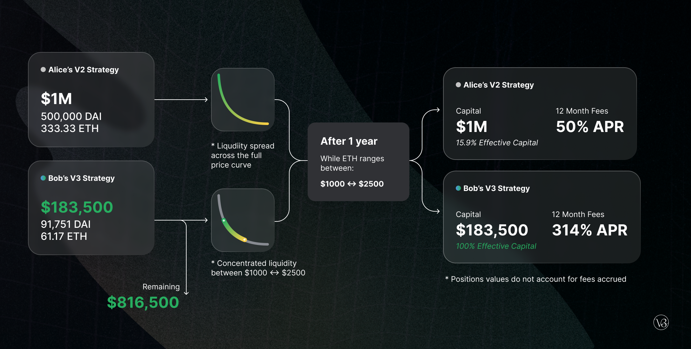
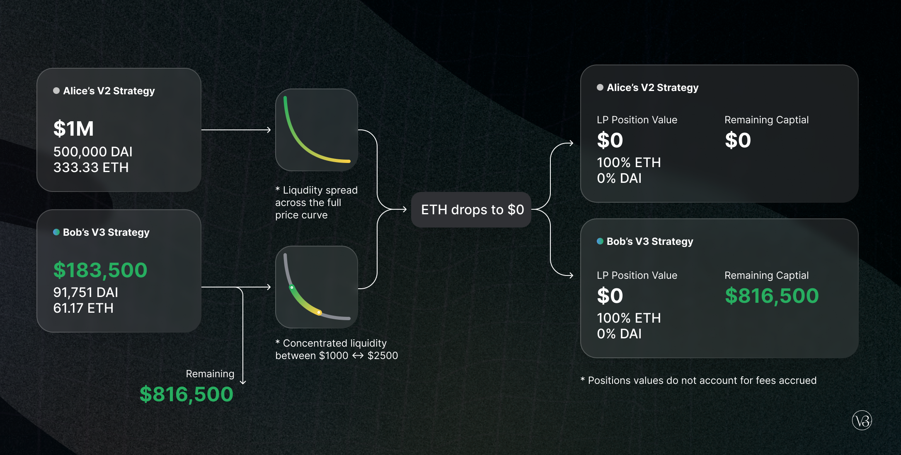
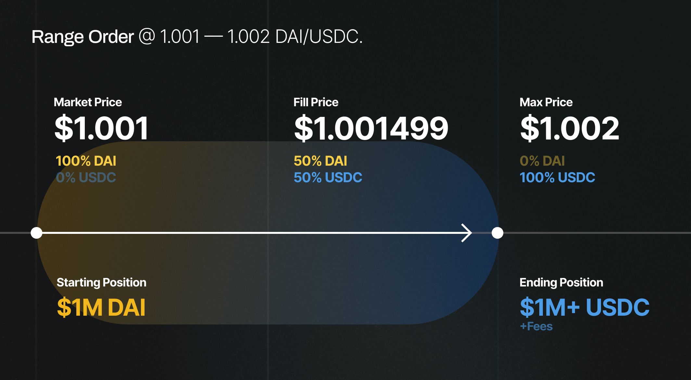
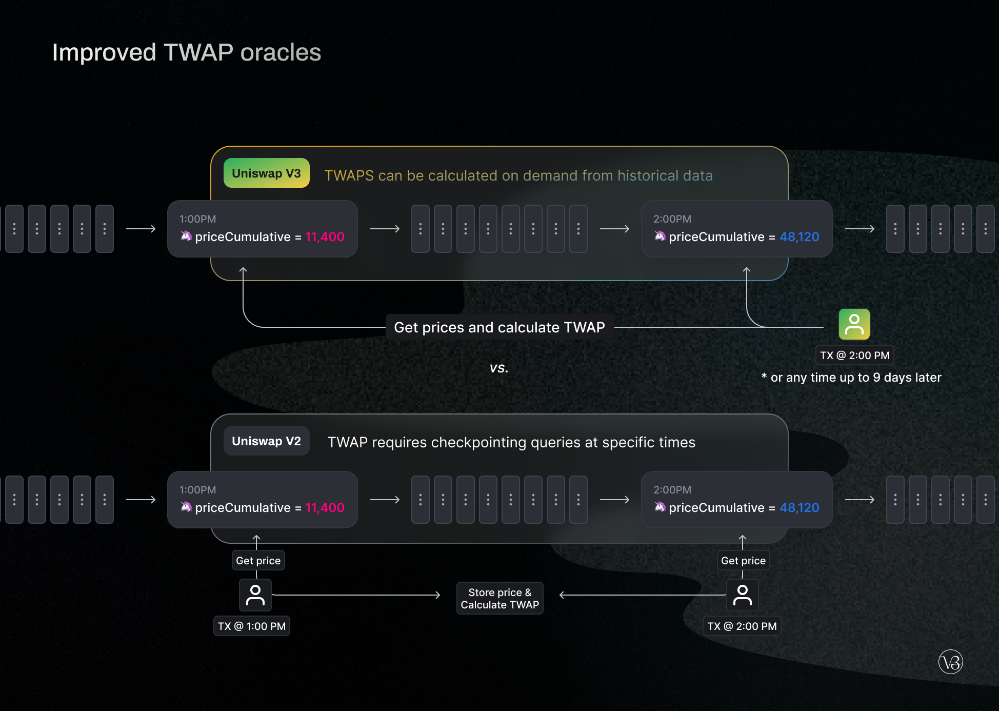

Uniswap v1 was launched in November 2018 as a proof of concept for automated market makers (AMMs), a type of exchange where anyone can pool assets into shared market making strategies.

In May 2020, Uniswap v2 introduced new features and optimizations, setting the stage for exponential growth in AMM adoption. Less than one year since its launch, v2 has facilitated over \$135bn in trading volume, ranking as one of the largest cryptocurrency spot exchanges in the world.

Uniswap now serves as critical infrastructure for decentralized finance, empowering developers, traders, and liquidity providers to participate in a secure and robust financial marketplace.

Today, we are excited to present an overview of Uniswap v3. We are targeting an **L1 Ethereum mainnet launch on May 5**, with an **L2 deployment on Optimism set to follow shortly after.**

Uniswap v3 introduces:

- **Concentrated liquidity,** giving individual LPs granular control over what price ranges their capital is allocated to. Individual positions are aggregated together into a single pool, forming one combined curve for users to trade against

- **Multiple fee tiers** , allowing LPs to be appropriately compensated for taking on varying degrees of risk

These features make Uniswap v3 **the most flexible and efficient AMM ever designed**:

- LPs can provide liquidity with **up to 4000x capital efficiency** relative to Uniswap v2, earning **higher returns on their capital**

- Capital efficiency paves the way for low-slippage **trade execution that can surpass both centralized exchanges and stablecoin-focused AMMs**

- LPs can significantly **increase their exposure to preferred assets** and **reduce their downside risk**

- LPs can sell one asset for another by adding liquidity to a price range entirely above or below the market price, approximating **a fee-earning limit order that executes along a smooth curve**

Uniswap&#39;s **oracles are now far easier and cheaper to integrate**. V3 oracles are capable of providing time-weighted average prices (TWAPs) on demand for any period within the last ~9 days. This removes the need for integrators to checkpoint historical values.

Even with these groundbreaking design improvements, the **gas cost of v3 swaps on Ethereum mainnet is slightly cheaper than v2**. Transactions made on the Optimism deployment will likely be _significantly_ cheaper!

Read on for more details on Uniswap v3. For a deeper technical overview check out the [Uniswap v3 Core whitepaper](/whitepaper-v3.pdf), the [Uniswap v3 Core smart contracts](https://github.com/Uniswap/uniswap-v3-core/).

# Concentrated Liquidity

In Uniswap v2, liquidity is distributed evenly along an x\*y=k price curve, with assets reserved for all prices between 0 and infinity. For most pools, a majority of this liquidity is never put to use. As an example, **the v2 DAI/USDC pair reserves just ~0.50% of capital for trading between $0.99 and $1.01** , the price range in which LPs would expect to see the most volume and consequently earn the most fees.

V2 LPs only earn fees on a small portion of their capital, which can fail to appropriately compensate for the price risk (&quot;impermanent loss&quot;) they take by holding large inventories in both tokens. Additionally, traders are often subject to high degrees of slippage as liquidity is spread thin across all price ranges.

In Uniswap v3, LP&#39;s can **concentrate their capital within custom price ranges, providing greater amounts of liquidity at desired prices.** In doing so, **LPs construct individualized price curves** that reflect their own preferences.

<Video option="CYL" description="V3 LPs can concentrate their liquidity within custom price ranges." />

LPs can combine any number of distinct concentrated positions within a single pool. For example, an LP in the ETH/DAI pool may choose to allocate $100 to the price ranges $1,000-$2,000 and an additional $50 to the ranges $1,500-$1,750.

By doing so, an LP can approximate the shape of any automated market maker or active order book.

**Users trade against the combined liquidity of all individual curves** with no gas cost increase per liquidity provider. Trading fees collected at a given price range are split pro-rata by LPs proportional to the amount of liquidity they contributed to that range.

<Video
  option="IS"
  description="LPs can combine multiple positions, which are then efficiently aggregated into a single order book."
/>

## Capital Efficiency

By concentrating their liquidity, LPs can provide **the same liquidity depth as v2 within specified price ranges while putting far less capital at risk.** The capital saved can be held externally, invested in different assets, deposited elsewhere in DeFi, or used to increase exposure within the specified price range to earn more trading fees.

<Video
  option="MFFL"
  description="Concentrated liquidity allows LPs to provide greater depth in fee generating price ranges."
/>

Let&#39;s illustrate with an example:

Alice and Bob both want to provide liquidity in an ETH/DAI pool on Uniswap v3. They each have \$1m. The current price of ETH is 1,500 DAI.

Alice decides to deploy her capital across the entire price range (as she would have in Uniswap v2). She deposits 500,000 DAI and 333.33 ETH (worth a total of \$1m).

Bob instead creates a concentrated position, depositing only within the price range from 1,000 to 2,250. He deposits 91,751 DAI and 61.17 ETH, worth a total of about $183,500. He keeps the other $816,500 himself, investing it however he prefers.

While Alice has put down 5.44x as much capital as Bob, _they earn the same amount of fees_, as long as the ETH/DAI price stays within the 1,000 to 2,250 range.

Bob&#39;s custom position also acts as a kind of stop-loss for his liquidity. Both Alice and Bob&#39;s liquidity will be entirely denominated in ETH if the price of ETH falls to $0. However, Bob will have lost just $159,000, versus Alice&#39;s $1m. Bob can use his additional $816,500 to hedge against downside exposure or to invest in any other conceivable strategy.

Instead of providing equivalent liquidity depth as a v2 LPs with less capital, v3 LPs can choose to provide **greater depth with the same amount of capital** as their v2 counterparts. This requires **taking on more price risk** (&quot;impermanent loss&quot;) while supporting greater amounts of trading and earning higher fees.

LPs in more stable pools will likely provide liquidity in particularly narrow ranges. If the ~$25m currently held in the Uniswap v2 DAI/USDC pair was instead concentrated between 0.99 — 1.01 in v3, it would provide the same depth as $5bn in Uniswap v2 as long as the price stayed within that range. **If the ~$25m was concentrated into the 0.999 - 1.001 range it would provide the same depth as $50b in Uniswap v2.**

The tool below calculates the capital efficiency gains of a concentrated liquidity position (centered around the current price) relative to allocating capital across the entire price curve.

<Simulator />

At launch, capital efficiency gains will max out at 4000x for LPs providing liquidity within a single 0.10% price range. The v3 pool factory is technically capable of supporting ranges as granular as 0.02%, translating to a maximum 20,000x capital efficiency gains relative to v2. However, more granular pools can increase swap gas costs and might be more useful on Layer 2.

## Active Liquidity

If market prices move outside an LP&#39;s specified price range, their liquidity is effectively removed from the pool and is no longer earning fees. In this state, an LP&#39;s liquidity is composed entirely of the less valuable of the two assets, until the market price moves back into their specified price range or they decide to update their range to account for current prices.

<Video option="AL" description="LPs only earn fees when the market trades between their specified price range." />

In v3, it is theoretically possible for no liquidity to exist in a given price range. However, we expect rational LPs to continuously update their price ranges to cover the current market price.

## Range Orders

V3&#39;s LP customizability opens up a novel order feature to complement market orders, which we are calling &#39;range orders&#39;.

LPs can deposit a single token in a custom price range above or below the current price: if the market price enters into their specified range, they sell one asset for another along a smooth curve while earning swap fees in the process.

Depositing to a narrow range feels similar to a traditional limit order. For example, if the current price of DAI is below 1.001 USDC, Alice could add \$10m worth of DAI to the range of 1.001 — 1.002 DAI/USDC.

Once DAI trades above 1.002 DAI/USDC, Alice&#39;s liquidity will have fully converted into USDC. Alice must withdraw her liquidity (or use a third-party service to withdraw on her behalf) to avoid automatically converting back into DAI if DAI/USDC starts trading below 1.002.

The average execution price of a fully executed range order is the geometric average of the minimum and maximum price: in Alice&#39;s case, the execution price equals 1.001499 DAI/USDC for a total of \$1,001,499. This execution price does not account for additional swap fees earned during the period in which prices trade within the 1.001 — 1.002 DAI/USDC range.

Range orders within wider ranges may prove particularly useful for **profit-taking, buying the dip,** and **primary issuance events**: in the later use case, issuers are now able to deposit liquidity in a single asset and specify the exact range of prices across which they wish to sell their tokens.

## Non-Fungible Liquidity

As a byproduct of per-LP custom price curves, liquidity positions are no longer fungible and are not represented as ERC20 tokens in the core protocol.

Instead, LP positions will be represented by non-fungible tokens (NFTs). However, common shared positions can be made fungible (ERC20) via peripheral contracts or through other partner protocols. Additionally, trading fees are no longer automatically reinvested back into the pool on LPs&#39; behalf.

Over time we expect increasingly sophisticated strategies to be tokenized, making it possible for LPs to participate while maintaining a passive user experience. This could include multi-positions, auto-rebalancing to concentrate around the market price, fee reinvestment, lending, and more.

# Flexible Fees

Uniswap v3 offers LPs three separate fee tiers per pair — 0.05%, 0.30%, and 1.00%. This array of options ensures that LPs tailor their margins according to expected pair volatility: LPs take on more risk in non-correlated pairs like ETH/DAI and, conversely, take on minimal risk in correlated pairs like USDC/DAI.

Although distinct fee tiers may lead to some degree of liquidity fragmentation, we believe that most pairs will calibrate to an &#39;obvious&#39; fee tier, which then serves as the canonical market. We expect like-kind asset pairs to congregate around the 0.05% fee tier and pairs like ETH/DAI to use 0.30%, while exotic assets might find 1.00% swap fees more appropriate. governance can add additional fee tiers as needed.

Uniswap v2 introduced a protocol fee switch, which allowed a flat 5 basis point (16.66% of LP fees) fee to be turned on by governance. Uniswap v3 protocol fees are far more flexible. Fees will be off by default, but can be turned on by governance on a per-pool basis and set between 10% and 25% of LP fees.

# Advanced Oracles

Uniswap v2 introduced time weighted average price (TWAP) oracles. These oracles serve as a critical piece of DeFi infrastructure, and have been integrated into dozens of projects, including Compound and Reflexer.

V2 oracles work by storing cumulative sums of Uniswap pair prices on a per-second basis. These price sums can be checked once at the beginning of a period and once at the end to calculate an accurate TWAP over that period.

Uniswap v3 offers significant improvements to the TWAP oracle, making it possible to calculate any recent TWAP within the past ~9 days in a single on-chain call. This is achieved by storing an array of cumulative sums instead of just one.

This array of historical price accumulators makes it far easier and cheaper to create more advanced oracles that include simple-moving averages (SMA), exponential moving averages (EMA), outlier filtering, and more.

Despite this major improvement, the gas cost to Uniswap traders for keeping oracles up to date has been reduced by ~50% relative to v2. The costs for calculating TWAPs in external smart contracts is significantly cheaper as well.

# License

We strongly believe decentralized financial infrastructure should ultimately be free, open-source software. At the same time, we think the Uniswap community should be the first to build an ecosystem around the Uniswap v3 Core codebase.

With this in mind, Uniswap v3 Core will launch under the [Business Source License 1.1](https://github.com/Uniswap/uniswap-v3-core/blob/main/LICENSE)—effectively **a time-delayed GPL-2.0-or-later license**. The license limits use of the v3 source code in a commercial or production setting for up to two years, at which point it will convert to a GPL license into perpetuity.

Uniswap governance can accelerate the change to GPL or grant exemptions to the license at any time by updating the files at _ **v3-core-license-date.uniswap.eth** _ and _ **v3-core-license-grants.uniswap.eth** _.

Note that the BUSL 1.1 license does not affect integrations. **All code that may be needed for external integrations has been licensed under GPL or MIT** , including math libraries, peripheral contracts, interfaces, and the developer sdk. Any wallet, interface, mobile app, protocol, or other project will be able to integrate with v3 as expected.

For more information on this license, see this [FAQ](https://mariadb.com/bsl-faq-adopting/).

# Audits and Bug Bounty

Our team believes security is of the utmost importance — it took hundreds of hours of testing for us to feel comfortable with launching Uniswap v3.

Our security process for v3 included:

- A full-length [audit from Trail of Bits](https://github.com/Uniswap/uniswap-v3-core/blob/main/audits/tob/audit.pdf)
- A full-length [audit from ABDK](https://github.com/Uniswap/uniswap-v3-core/blob/main/audits/abdk/audit.pdf)
- A full audit from [samczsun](https://samczsun.com/) (no report)
- An auditing and review process from our engineering team
- A comprehensive test suite, including the automated tools Echidna and Manticore

Major bugs discovered as part of the testing and auditing process were fixed. However, we would like to note that Uniswap v3 is an extremely complex protocol and we cannot guarantee all bugs have already been discovered and resolved.

To help find any open vulnerabilities, a public bug bounty will run over the next 30 days, with up to \$500,000 offered for critical bugs. More detail on the public bug bounty can be found [here](https://github.com/Uniswap/uniswap-v3-core/blob/main/bug-bounty.md).

# Launch Details

The Uniswap v3 smart contracts will be deployed to the Ropsten, Rinkeby, Kovan, and Görli testnets in the coming days, giving developers time to begin experimenting with the protocol before the official launch.

- The [Uniswap v3 Core repository](https://github.com/Uniswap/uniswap-v3-core) contains the essential, low-level smart contracts that power the protocol.

- The [Uniswap v3 Periphery repository](https://github.com/Uniswap/uniswap-v3-periphery) contains a collection of smart contracts designed to ease user interaction with core contracts.

A liquidity provider migration portal will be available at launch, allowing v2 LPs to seamlessly transfer their liquidity to the new protocol.

In the meantime, there are few outstanding items to complete:

- Partners and integrations can begin building on Uniswap v3 immediately, in preparation for mainnet launch!

- The interface, analytics site, API, and developer SDK are being redesigned to work with Uniswap v3.

- The initial Uniswap v3 router and position manager contracts are almost complete. While still subject to change, they are available [here](https://github.com/Uniswap/uniswap-v3-periphery).

- Documentation, guides, and further examples are in progress.

- Additional infrastructure to support fungibile positions, liquidity mining, more complex strategies, and various other use cases will be built by Uniswap Labs together with the Uniswap community **after mainnet launch**

## Reach out

On Friday, March 26 at 2pm ET we will host an AMA on the official Uniswap Discord, where we hope to answer any outstanding questions you may have around Uniswap v3. Questions can be submitted ahead of time [here](https://docs.google.com/forms/d/e/1FAIpQLSebgW4Ta1Iq4gaPKvcDExliyGjrfUpvWeJKRAPD1KK7s-cNNw/viewform?usp=sf_link).

We will be releasing further updates, additional information, and initial documentation over the coming days and welcome all feedback and involvement from our community.

If you are integrating and wish to get in touch, please fill out this [form](https://docs.google.com/forms/d/e/1FAIpQLSfH6fFaaCoPlDW570ZYN-9VOS_-Fu9gl8rRFoANtx0XWQtNaQ/viewform?usp=sf_link) and we will try to respond as soon as possible. Alternatively, reach out in the #v3-integrations channel in the community Discord

To get involved and stay up to date:

- Join the Uniswap community [discord](https://discord.gg/FCfyBSbCU5)
- Follow Uniswap on [Twitter](https://twitter.com/Uniswap)
- Subscribe to the Uniswap [blog](/blog)
- Register as a delegate [Sybil](http://sybil.org/)
- Participate in [Uniswap governance](http://gov.uniswap.org/)

Uniswap Team
🦄
