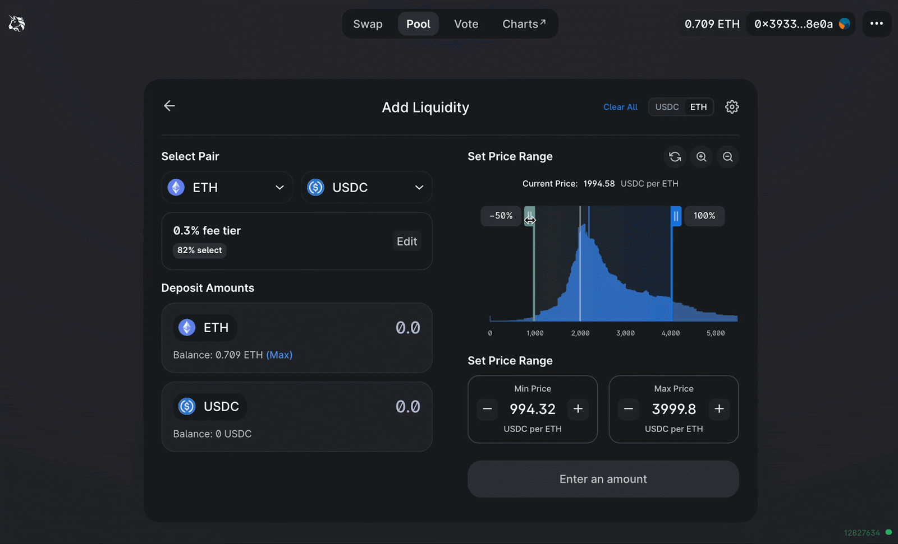
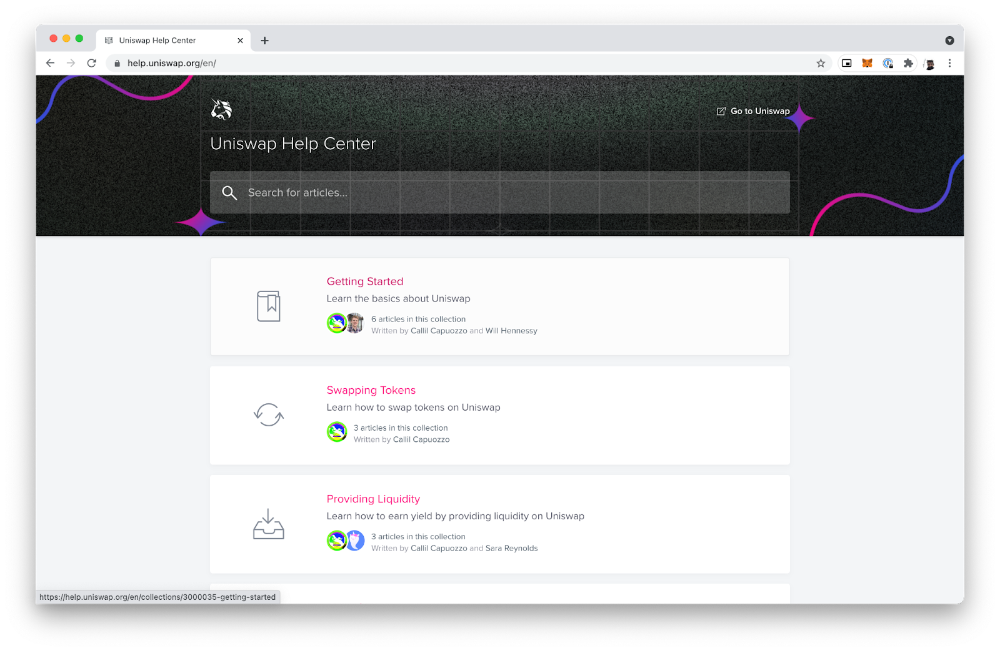

Over the past few weeks, our team has spoken with dozens of traders,
LPs, developers and community members to learn about their experiences
interacting with Uniswap.

Going forward, we want to share regular updates with the community. This
post marks the first in a series highlighting product developments that
improve the overall user experience.

Today, we are excited to announce the release of six new features and
improvements:

- Auto Fee Tier Selection

- Liquidity Range Charts

- Create Proposal UI

- 30 Language Translations and crowdsourcing tool

- Uniswap Help Center

- Docs improvements and new landing page

# Auto Fee Tier Selection

In our conversation with liquidity providers, many expressed uncertainty
when selecting their fee tier. Which fee tier is optimal? Why not always
pick the highest one?

To help LPs select the right fee tier, the app now automatically
defaults to the fee tier with the most liquidity. This method leverages
the wisdom of the market to suggest a reasonable fee tier for most LP
strategies. LPs can always manually select fee tiers by clicking the
‘edit’ button to reveal additional fee tiers and their respective
liquidity allocation percentages.

_The 0.30% fee tier is auto-selected because it holds 82% of liquidity
across all v3 ETH-USDC pairs._

Fee tier selection is nuanced and in certain scenarios an LP may choose
a tier with lower TVL (e.g. ETH/DAI 0.05%). That said, we believe TVL is
a good heuristic for the average user.

Alongside the Uniswap community, the Uniswap Labs team will continue to
monitor the efficacy of this metric and we welcome additional feedback.

# Liquidity Range Charts

Uniswap v3 introduces the concept of Concentrated Liquidity — a major
improvement from previous AMM designs, LPs can now selectively allocate
their liquidity between minimum and maximum price ranges, earning a
higher percentage of trading fees with less capital in the process.

In our user research interviews, we heard users rely on alternative
tools and charts to select their price ranges. Many users flipped back
and forth between the Uniswap App and Uniswap Info to view the liquidity
distribution for a pair.

As of today, the LP interface will display the real-time distribution of
liquidity in the selected pool, providing insight into the aggregate
market’s opinion as to how liquidity should be best allocated. LPs can
use the range sliders to adjust their minimum and maximum prices
alongside the pre-existing manual input fields.

_Liquidity in the ETH-USDC 0.30% pair is increasingly more concentrated
around the mid-price._

We hope that this data visualization will help users understand the
concept of a price range and quickly select a range that fits their risk
preferences. For more guidance, check out this [_How To
Guide_](https://help.uniswap.org/en/articles/5391541-providing-liquidity-on-uniswap-v3).

# Create Proposal

Uniswap’s governance system requires participants to submit executable
code alongside their written proposal. To date, this has limited the
number of potential proposal participants to those that are intimately
familiar with the inner workings of Solidity.

Now that the proposal threshold has been reduced from 10m UNI to 2.5m
delegated UNI, we believe it is especially important that non-technical
delegates can actively participate in proposal submission.

We have now introduced the addition of a ‘Create Proposal’ feature in
the governance interface. Users can select a proposed action (Transfer,
Approve), a target address, and a target asset to accompany their
proposal text.

Over the coming weeks we will introduce additional actions including:
updating the ENS; updating the v3 license, and creating liquidity mining
programs and more.

# Translations

The Uniswap Protocol is global financial infrastructure, serving users
from all around the world.

To better support our international user base, the Uniswap Interface now
includes over 30 languages. The default language is set according to
your browser’s language settings, but this can be changed manually
through the dropdown menu.

If you would like to contribute to translation quality, please visit the
[_Crowdin Uniswap translations
hub_](https://crowdin.com/project/uniswap-interface). Anyone can improve
the translations by making an account on Crowdin and submitting changes.
You can also start translations for new languages that may not be
currently supported on the interface.

# Help Center

This week we launched the [_Uniswap Help
Center_](https://help.uniswap.org/) to address common questions and
issues that affect our users. We’ve also published a number of How To
guides, starting with an [_Optimism
collection_](https://help.uniswap.org/en/collections/3033942-layer-2) to
accompany the protocol’s recent launch on Layer 2.

We’ll continue adding new content on an ongoing basis and warmly welcome
suggested topics from the community. We will also soon offer direct
access to the Help Center through the application.

# Docs

Uniswap Docs has received a fresh coat of paint!

Users can now view and search through documentation and contracts across
all three protocols in one consolidated venue. We have also added
further technical guides around the
[_Swap_](https://docs.uniswap.org/protocol/guides/swaps/single-swaps)
and [_Flash
Swap_](https://docs.uniswap.org/protocol/guides/flash-integrations/inheritance-constructors)
functions in v3.

V3 Add Liquidity and SDK guides are coming very soon!

# Community Feedback

We are beyond grateful for our engaged community members, who are
consistently willing to volunteer time and provide feedback to improve
our products.

The feature updates released today, alongside upcoming updates, are the
direct result of numerous user conversations: a very special shoutout to
[_Rizzle_](http://twitter.com/nftland), Mark Jeffrey,
[_Epheph_](http://www.twitter.com/epheph), [_Haye
Chan_](http://twitter.com/defiahab), Drew Korn, Alex Komorav, Cyrus
Ansari, [_Will Price_](https://twitter.com/will__price), Wario, reuptake
and the [_LP cafe discord_](https://discord.gg/UKm6BzkJ).

We want to keep hearing from you! As always, the Uniswap Labs team can
be found in the community [_discord_](https://discord.gg/FCfyBSbCU5) and
on Twitter. If you are willing to volunteer 15 minutes for a user
feedback session, please fill in [_this
form_](https://forms.gle/3gZ6NVQSATHoqz7MA) and we will be in contact as
soon as possible.

---

To get involved and stay up to date:

- Join the Uniswap community [discord](https://discord.gg/FCfyBSbCU5)
- Follow Uniswap on [Twitter](https://twitter.com/Uniswap)
- Subscribe to the Uniswap [blog](/blog)
- Register as a delegate [Sybil](http://sybil.org/)
- Participate in [Uniswap governance](http://gov.uniswap.org/)

Uniswap Team
🦄
