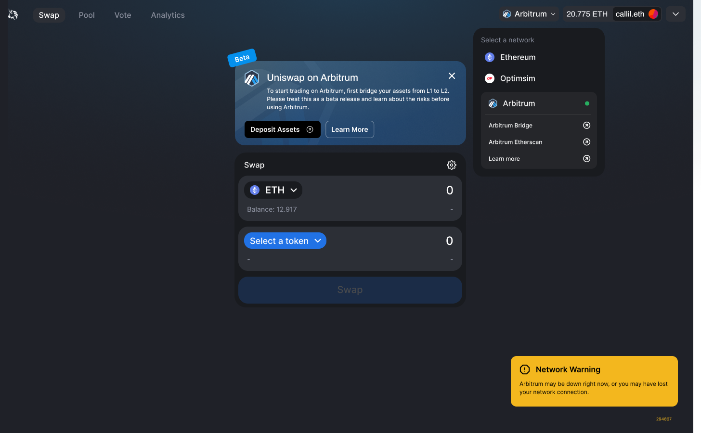

Today, we are excited to share some recent features and improvements to the Uniswap ecosystem:

- Layer 2 Beta (Improved UX!)
- Developer Guides
- Help Center
- EIP-1559 Support
- ENS on Sybil

# Layer 2 Beta

The Uniswap v3 deployments on Optimistic Ethereum and Arbitrum are ready to graduate from Alpha to Beta.

We’re excited to release the network selector dropdown in the Uniswap App! Starting with today’s Beta release, users can seamlessly access all supported networks directly in the Uniswap App.

We’ve also released a fast confirmation UX to showcase the lightning speed of Layer 2 networks!

Lastly, as a precautionary measure, we’ve implemented downtime detection so the Uniswap App will report liveness of the network.

The early successes of Optimistic Ethereum and Arbitrum have been incredibly promising. We’re excited to offer a better experience in the Uniswap App and hope it will invite more users to experiment with L2 networks.

**Optimistic Ethereum** - Since launching Uniswap v3 on [Optimistic Ethereum](https://uniswap.org/blog/uniswap-optimism-alpha/) two months ago, total value locked ([TVL](https://info.uniswap.org/#/optimism/)) has steadily grown to $35M. Over the past 30 days alone, 49,000 unique addresses have generated $165m volume across 158k trades, regularly saving up to 25x on swap costs relative to L1!

We want to highlight that the Optimistic Ethereum network will undergo a [‘Regenesis’](https://medium.com/ethereum-optimism/the-future-of-optimistic-ethereum-7f22d987331). Both Uniswap Labs and the Optimism team will provide further reminders and notices as we get closer to the Regenesis event.

**Arbitrum** - Uniswap v3 was deployed on Arbitrum on [June 2](https://github.com/Uniswap/uniswap-interface/pull/1716) following a community [snapshot](https://snapshot.org/#/uniswap/proposal/Qmehop1NNWP9VEf7tGLEAYRphVsXtdxkL7oKEhaXL2Xao6) vote. The network [officially opened](https://uniswap.org/blog/uniswap-arbitrum-alpha/) to the public on August 31 and adoption has quickly soared: over the past two weeks, the Arbitrum deployment has seen over $345M [trade volume](https://info.uniswap.org/#/arbitrum/) on $39M [TVL](https://info.uniswap.org/#/optimism/)!

Although user funds were never at risk, the Arbitrum sequencer [experienced 45 minutes of downtime](https://medium.com/offchainlabs/arbitrum-one-outage-report-d365b24d49c) on September 14. We want to remind users that further outages are still possible as the Arbitrum network continues to find its feet. Nevertheless, we believe that the limited extent and severity of issues to date warrants cautiously moving the Uniswap v3 deployment to Beta status.

# Developer Guides

We are committed to educating developers and making the Uniswap protocol more accessible to all with informative developer docs and guides.

To that end, we have published six new developer guides:

- Smart Contract Guides
  - [How to Swap](https://docs.uniswap.org/protocol/guides/swaps/single-swaps)
  - [How to Provide Liquidity](https://docs.uniswap.org/protocol/guides/providing-liquidity/setting-up)
  - [How to Create a Liquidity Mining program](https://docs.uniswap.org/protocol/guides/liquidity-mining/liquidity-mining-overview)
- Javascript SDK Guides
  - [How to Swap](https://docs.uniswap.org/sdk/guides/execute-a-swap)
  - [How to Provide Liquidity](https://docs.uniswap.org/sdk/guides/liquidity/minting)
  - [How to Fetch Spot Prices](https://docs.uniswap.org/sdk/guides/fetching-prices)

We’ll continue publishing docs on a weekly basis so stay tuned for more!

# Help Center

We are steadily expanding the Uniswap [Help Center](https://help.uniswap.org/en/) to offer more walkthroughs and FAQs.

Recently we published a complete set of guides to walk you through every step from deposit to withdrawal on Layer 2 [Optimistic Ethereum](https://help.uniswap.org/en/collections/3137778-uniswap-on-optimistic-ethereum-o%CE%BE) and [Arbitrum User Guides](https://help.uniswap.org/en/collections/3137787-uniswap-on-arbitrum). We’ve also added an [FAQ](https://help.uniswap.org/en/collections/3033722-faq) and article about [Swap Error Codes](https://help.uniswap.org/en/articles/5392378-swap-errors-advanced).

# EIP-1559 Support

Ethereum upgraded to EIP-1559 last month and we’re happy to say that it is fully compatible with the Uniswap app. The app now sends a type 2 transaction to nudge your wallet to choose the optimal Base Fee and Priority Fee for your transaction.

Since the EIP-1559 launch, 43,577 ETH has been burned by transactions interacting with the Uniswap Protocol.

# ENS on Sybil

We’ve added Ethereum Name Service (ENS) support to [sybil.org](https://sybil.org)! If an address is not Twitter verified, Sybil will now fetch their ENS name to help you identify the delegate.

---

To get involved and stay up to date:

- Join the Uniswap community [discord](https://discord.com/invite/FCfyBSbCU5)
- Follow Uniswap Labs on [Twitter](https://twitter.com/Uniswap)
- Subscribe to the Uniswap Labs [blog](https://uniswap.org/rss.xml)
- Register as a delegate on [Sybil](https://sybil.org/#/delegates/uniswap)
- Participate in Uniswap [governance](https://gov.uniswap.org/)

Uniswap Team
🦄
