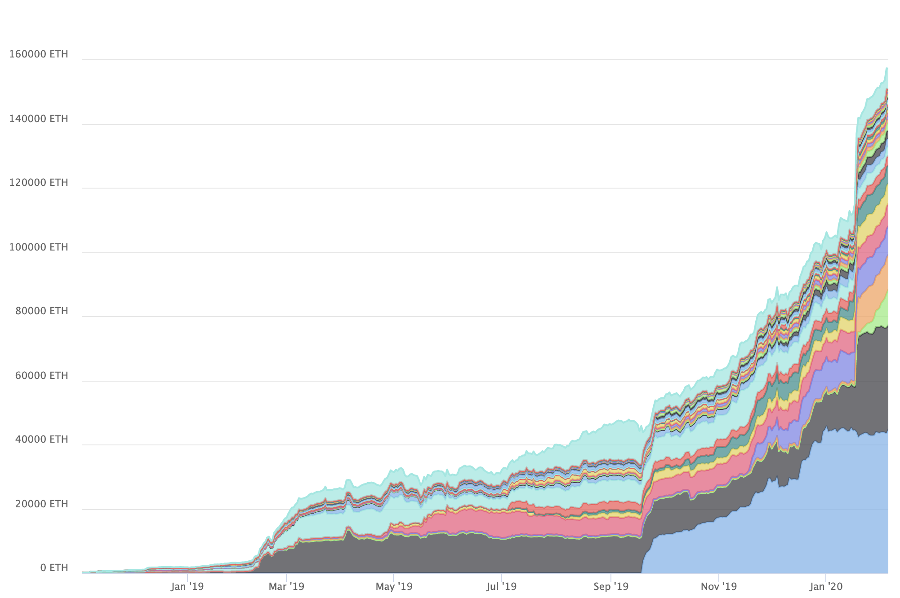
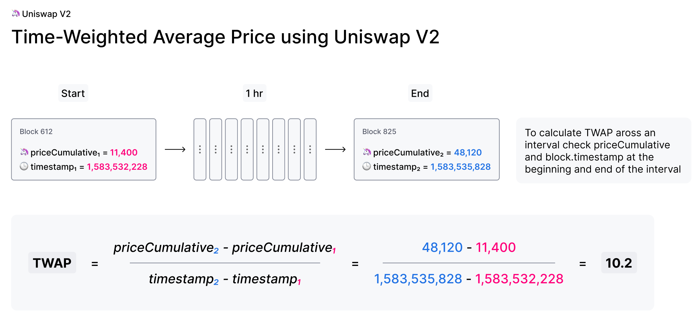
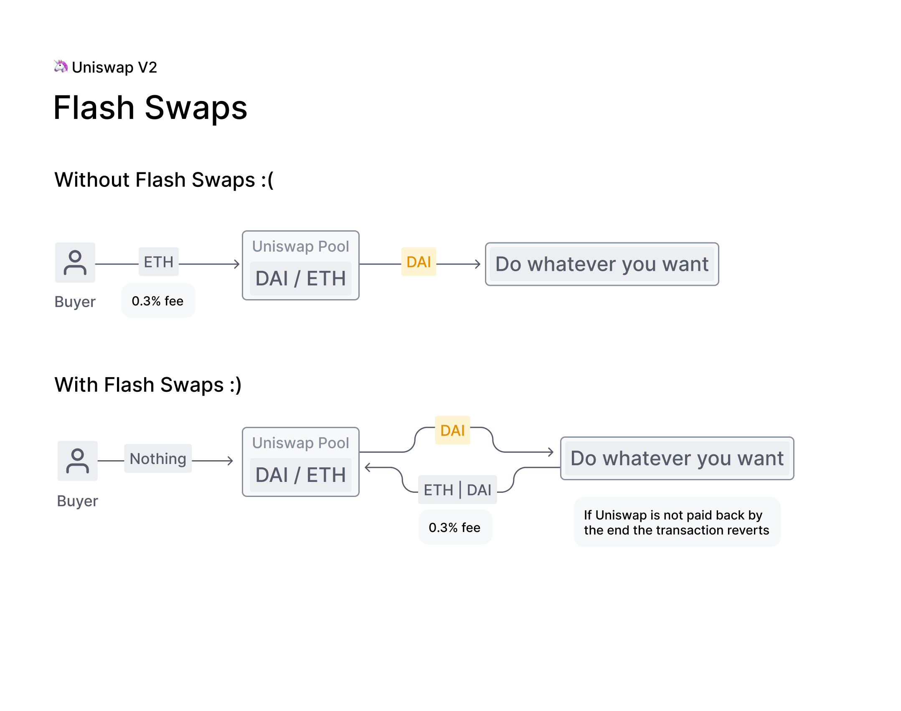

**Uniswap V1** was the proof-of-concept for a new type of decentralized marketplace.

As a venue for pooled, automated liquidity provision on Ethereum, the Uniswap protocol (Uniswap) functions without upkeep, providing an unstoppable platform for ERC20 token conversion. **Uniswap V1 will continue to work for as long as Ethereum exists**, and so far, it has worked very nicely for a wide variety of use cases.

However, pooled automated liquidity remains nascent technology, and **we have only just begun to realize its potential**. For this reason, last year [we raised a seed round](https://finance.yahoo.com/news/paradigm-backs-decentralized-exchange-protocol-184824051.html) and formed a dedicated team to research and develop Uniswap alongside the broader Ethereum community.

**Uniswap V2** is our second iteration of Uniswap and includes many new features and improvements. This article will serve as a high-level overview of these changes including:

- [ERC20 / ERC20 Pairs](#erc20--erc20-pairs)
- [Price Oracles](#price-oracles)
- [Flash Swaps](#flash-swaps)
- [Core/Helper Architecture](#corehelper-architecture)
- [Technical Improvements](#technical-improvements)
- [Path to Sustainability](#path-to-sustainability)
- [Testnet and Launch Details](#testnet-and-launch-details)

For full details check out the:

- [Core smart contracts](https://github.com/Uniswap/uniswap-v2-core/)
- [Periphery smart contracts](https://github.com/Uniswap/uniswap-v2-periphery)
- <a href='/whitepaper.pdf' target='_blank' rel='noopener noreferrer'>Uniswap V2 Technical Whitepaper</a>
- <a href='https://docs.uniswap.org'>Uniswap V2 Documentation</a> (in progress!)

## ERC20 / ERC20 Pairs

In Uniswap V2, **any ERC20 token can be pooled directly with any other ERC20 token**. Wrapped Ether (WETH) is used instead of native ETH in the core contracts, although end users can still use ETH through helper contracts.

In Uniswap V1, all liquidity pools are between ETH and a single ERC20 token. Having a constant numeraire provides a nice UX advantage — users can swap any ERC20 for any other ERC20 by routing through ETH. Since ETH is the most liquid Ethereum-based asset, and does not introduce any new platform risk, it was the best choice for Uniswap V1.

However, the introduction of ERC20 token/ERC20 token pools in Uniswap V2 can be **useful for liquidity providers, who can maintain more diverse ERC20 token denominated positions**, without mandatory exposure to ETH. One example would be a DAI/USDC pair, which should theoretically have little volatility for liquidity providers, but is useful for trading.

Having direct ERC20/ERC20 pairs can also improve prices because routing through ETH for a swap between two other assets (say, DAI/USDC) involves paying fees and slippage on two separate pairs instead of one.

If two ERC20 tokens are not paired directly, and do not have a common pair between them, they can still be swapped as long as a path between them exists. Router contracts can be used to optimize between direct and multi-step swaps.

We still anticipate ETH pairs being very popular, but expect to see growth in other types of pairs over time.

## Price Oracles

**Uniswap V2 implements new functionality that enables highly decentralized and manipulation-resistant on-chain price feeds.** This is achieved by measuring prices when they are expensive to manipulate, and cleverly accumulating historical data. This allows external smart contracts to create gas-efficient, time-weighted averages of Uniswap prices across **any** time interval.

**On-chain price feeds are a critical component for many decentralized financial applications** including those similar to derivatives, lending, margin trading, prediction markets and more. Despite [closely tracking the real-world price](https://arxiv.org/abs/1911.03380) most of the time, Uniswap V1 cannot be used safely as a price oracle because the price can move significantly in a short period of time.

Uniswap V2 includes a number of improvements for price feeds built on top of it. First, every pair measures (but does not store) the market price at the beginning of each block, before any trades take place. This price is expensive to manipulate because it was set by the last transaction in a previous block.

**To set the measured price to one that is out of sync with the global market price, an attacker has to make a bad trade at the end of a previous block** , typically with no guarantee that they will be able to arbitrage it back in the next block. Attackers will lose money to arbitrageurs, unless they can "selfishly" mine two blocks in a row. This type of attack presents a number of challenges and [has not been observed to date](https://arxiv.org/abs/1912.01798).

This alone is not enough. If significant value settles based on the price resulting from this mechanism, then the profit of an attack likely can outweigh the loss.

Instead, Uniswap V2 adds this end-of-block price to a single cumulative-price variable in the core contract weighted by the amount of time this price existed. **This variable represents a sum of the Uniswap price for every second in the entire history of the contract.**

This variable can be used by external contracts to track accurate time-weighted average prices (TWAPs) across any time interval.

This is done by reading the cumulative price from an ERC20 token pair at the beginning and at the end of the interval. The difference in this cumulative price can then be divided by the length of the interval to create a TWAP for that period.

TWAPs can be used directly or as the basis for moving averages (EMAs and SMAs) as needed.

A few notes:

- For a 10-minute TWAP, sample once every 10 minutes. For a 1-week TWAP, sample once every week.
- For a simple TWAP, the cost of manipulation increases (approx. linear) with liquidity on Uniswap, as well as (approx. linear) with the length of time over which you average.
- Cost of an attack is relatively simple to estimate. Moving the price 5% on a 1-hour TWAP is approximately equal to the amount lost to arbitrage and fees for moving the price 5% every block for 1 hour.

There are some nuances that are good to be aware of when using Uniswap V2 as an oracle, especially where manipulation resistance is concerned. The <a href='/whitepaper.pdf' target='_blank' rel='noopener noreferrer'>whitepaper</a> elaborates on some of them. Additional oracle-focused developer guides and documentation will be released soon.

In the meantime, check out our [example implementation](https://github.com/Uniswap/uniswap-v2-periphery/blob/master/contracts/examples/ExampleOracleSimple.sol) of a 24 hr TWAP Oracle built on Uniswap V2!

## Flash Swaps

**Uniswap V2 flash swaps** allow you to withdraw as much as you want of any ERC20 token on Uniswap at no upfront cost and do anything you want with them (execute arbitrary code), provided that by the end of the transaction execution, you either:

- pay for all ERC20 tokens withdrawn
- pay for a percentage of ERC20 tokens and return the rest
- return all ERC20 tokens withdrawn

Liquidity provider fees are enforced by subtracting 0.3% from all input amounts, even if the input ERC20 tokens are being returned as part of a flash swap.

It is often the case that a series of transactions on Ethereum has a high upfront cost but ultimately a low net cost or is even net profitable by the end of the series. **Flash swaps** are incredibly useful because they **remove upfront capital requirements and unnecessary constraints on order-of-operations** for multi-step transactions that use Uniswap.

One example is **arbitrage with no upfront capital**. Imagine a scenario where you can sell 200 DAI for 1 ETH on Uniswap and then sell that 1 ETH on Oasis for 220 DAI at a 20 DAI profit. But, unfortunately, you don't have any DAI in your wallet.

With flash swaps you could synchronously withdraw 1 ETH from Uniswap, sell it on Oasis for 220 DAI and then pay for the ETH on Uniswap with 200 of the DAI you just purchased.

Another example use case is **improving the efficiency of margin trading protocols** that borrow from lending protocols and use Uniswap for ERC20 token conversion. This is currently done with the following process:

1. add user ETH to Maker,
2. borrow DAI from Maker
3. swap DAI for ETH on Uniswap
4. repeat steps 1–3 **multiple times** until you reached desired leverage

With flash swaps this process is simplified to:

1. withdraw all ETH you want from Uniswap
2. add user and Uniswap ETH to Maker
3. borrow all DAI you need from Maker
4. return DAI to the Uniswap protocol

If the Uniswap pool does not receive enough DAI to cover the ETH withdrawn, then the entire transaction will revert; thus, all ERC20 tokens are returned or paid for at the end of the transaction.

## Core/Helper Architecture

[Uniswap V2 Core](https://github.com/Uniswap/uniswap-v2-core) are the essential Uniswap V2 smart contracts, consisting of:

- [UniswapV2Pair.sol](https://github.com/Uniswap/uniswap-v2-core/blob/master/contracts/UniswapV2Pair.sol), which implements core swapping and liquidity provision functionality
- [UniswapV2Factory.sol](https://github.com/Uniswap/uniswap-v2-core/blob/master/contracts/UniswapV2Factory.sol), which deploys [UniswapV2Pair.sol](https://github.com/Uniswap/uniswap-v2-core/blob/master/contracts/UniswapV2Pair.sol) contracts for any ERC20 token/ERC20 token pair

**Core is minimalist in design, removing all logic that is not strictly necessary to secure liquidity stored in its pools.** Logic related to trader security or ease-of-use must be implemented in external helper contracts. Since external helpers can be improved and replaced without needing to migrate liquidity, **this improves on the flexibility and modularity of Uniswap.**

[Uniswap V2 Periphery](https://github.com/Uniswap/uniswap-v2-periphery) (periphery) is an initial set of helpers, including:

- [A router contract](https://github.com/Uniswap/uniswap-v2-periphery/blob/master/contracts/UniswapV2Router01.sol) that performs the safety checks needed for safely swapping, adding, and removing liquidity.
- [A migrator contract](https://github.com/Uniswap/uniswap-v2-periphery/blob/master/contracts/UniswapV2Migrator.sol) that can remove liquidity from Uniswap V1 and deposit it into Uniswap V2 in a single transaction.
- [A library contract](https://github.com/Uniswap/uniswap-v2-periphery/blob/master/contracts/libraries/UniswapV2Library.sol) that can be used in the creation of other helper contracts.
- [An example oracle contract](https://github.com/Uniswap/uniswap-v2-periphery/blob/master/contracts/examples/ExampleOracleSimple.sol) that creates a simple TWAP from Uniswap V2 cumulative prices.
- [An example flash swap contract](https://github.com/Uniswap/uniswap-v2-periphery/blob/master/contracts/examples/ExampleFlashSwap.sol) that withdraws ERC20 tokens, executes arbitrary code, and then pays for them.

_Periphery contracts described as "Example" are for illustrative purposes only and should not be used in actual transactions._

While this is a huge improvement, there are some new smart contract patterns introduced which developers building on top of Uniswap should be aware of.

- Core uses WETH instead of ETH. Routers can convert between ETH and WETH allowing users to use ETH directly
- Core stores ERC20 token balances internally instead of relying on the balances stored in the ERC20 token contract
- Core no longer calls **transferFrom** on **msg.sender**. Instead ERC20 tokens should be sent to core directly by a router before calling the **swap** , **mint** or **burn** functions.
- Core will determine the number of ERC20 tokens sent to it based on the difference between its current and stored balances.
- Core no longer returns the maximum number of ERC20 tokens for a given input amount. Instead, a router must specify the number of ERC20 tokens it wants. Core will send this number as long as the invariant is preserved after taking 0.3% off any input amount.
- Routers should handle logic around slippage safety checks and multihop trades.

For additional details please read the <Link to='/docs/v2/protocol-overview/smart-contracts/'>architecture section</Link> of the in-progress Uniswap V2 docs or the core and periphery smart contracts themselves.

## Technical Improvements

Uniswap V2 contains many other significant changes and improvements including the following:

- Smart contracts are written in Solidity instead of Vyper
- Use CREATE2 to make the pool address deterministic based on the ERC20 token pair
- Uniswap V2 properly handles ["missing return" ERC20 tokens](https://medium.com/coinmonks/missing-return-value-bug-at-least-130-tokens-affected-d67bf08521ca) that do not work on Uniswap V1, such as USDT and OMG
- Built in metaTransaction "approve" function for liquidity tokens
- Increase re-entrancy protection using mutex (adds support for ERC777 and other non-standard ERC20 tokens)
- Fix bug from Uniswap V1 that uses all remaining gas on failing transactions
- More descriptive error messages. The above bug caused failing transactions to only return the error "Bad Jump Destination"

## Path to Sustainability

Decentralization is in many ways about increasing participation and removing central points of failure. Uniswap V1 is already highly decentralized, trustless, and censorship resistant. But for it to achieve its full potential as infrastructure in a fair and open financial system — **it must continue to grow and improve**.

To open a path to self-sustainability, the code for Uniswap V2 includes a small protocol charge mechanism. At launch, the protocol charge will default to 0, and the liquidity provider fee will be 0.30%. If the protocol charge is switched on, it will become 0.05% and the liquidity provider fee will be 0.25%.

This feature, including the exact percentage amounts, is hardcoded into the core contracts which remain decentralized and non-upgradable. It can be turned on, and directed by, a decentralized governance process deployed after the Uniswap V2 launch. There is no expectation that it will be turned on in the near future but it opens the possibility for future exploration.

[https://twitter.com/jessewldn/status/1135741055045967874](https://twitter.com/jessewldn/status/1135741055045967874)

In the Classical Period of crypto (2014), [Vitalik described](https://blog.ethereum.org/2014/05/06/daos-dacs-das-and-more-an-incomplete-terminology-guide/) decentralized autonomous organizations (DAOs) as "automation at the center, humans at the edges."

> an entity that lives on the internet and exists autonomously, but also heavily relies on hiring individuals to perform certain tasks that the automaton itself cannot do

This perfectly describes the Uniswap protocol's path forward. In Uniswap V1 pricing, coordination, listing, and trade execution are fully automated while arbitrage and liquidity provision are incentivized.

However, **the best version of Uniswap will be one that autonomously incentivizes contributions to its own growth and development** as well as to the broader ecosystem in which it exists--one that supports the contributions of the **incredible community** that has formed and continues to grow.

Uniswap is an ideal candidate for exploring decentralized on-chain cash flows. **Without any additional growth**, it will generate more than $5M in liquidity provider fees this year. If the protocol charge was on, ~$830,000 of this would instead go to a decentralized funding mechanism used to support contributions to Uniswap and its ecosystem.

**This type of support boosts network effects from which Uniswap and its users benefit greatly.** Incentivized contributions lead to increased protocol functionality and usage. Usage generates fees which attracts liquidity. Increased liquidity further entrenches Uniswap, attracting additional users, contributors, and integrations.

For more details, please refer to the technical <a href='/whitepaper.pdf' target='_blank' rel='noopener noreferrer'>whitepaper</a> or code.

## Testnet and Launch Details

While the core smart contracts are finished, additional work is still in progress.

- Uniswap V2 smart contracts are undergoing formal verification and security auditing. Bug bounties will be used to encourage additional community security review.
- The interface, analytics site, API, and developer SDK are being updated to work with Uniswap V2.
- Documentation, guides, and examples are still being worked on.
- When everything else is ready, a simple migration UX will be released to improve the experience of moving from Uniswap V1 to Uniswap V2

Pending a successful formal verification, we are optimistic that Uniswap V2 can be deployed in Q2 of this year. However, please keep in mind that this is a target and not an announced release date.

In the meantime, developers can begin playing with Uniswap V2 today! The factory and an initial router smart contract have already been deployed to the Ropsten, Rinkeby, Kovan, and Görli testnets.

**<Link to='/docs/v2/smart-contracts/factory/#address'>Uniswap V2 Factory (Testnet)</Link>**

**<Link to='/docs/v2/smart-contracts/router01/#address'>Uniswap V2 Router 01 (Testnet)</Link>**

**We want to hear from you!**

We will be releasing additional updates, information, and documentation over the coming months. We look forward to continued feedback and involvement from the fantastic Uniswap community. To get involved and stay up to date:

- [Join the Uniswap community discord](https://discord.gg/FCfyBSbCU5)
- [Follow Uniswap on Twitter](https://twitter.com/Uniswap)
- Subscribe to the <Link to='/blog/'>Uniswap blog</Link>
