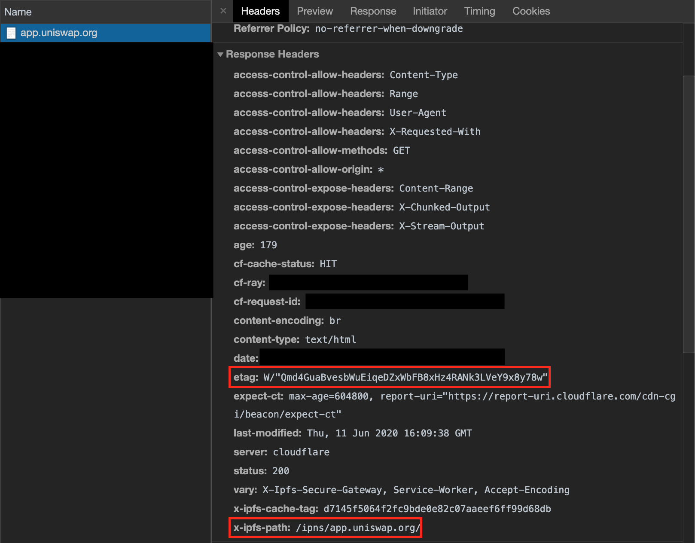

The [Uniswap Interface](https://app.uniswap.org) is now hosted and served exclusively from [IPFS](https://ipfs.io)!

The Uniswap team has always cared about decentralization,
fairness and accessibility. We’ve built all our code in open
source so every version of Uniswap can continue to operate
in perpetuity with or without us.

We’ve just taken one more step towards that goal,
by decentralizing the hosting and serving of the Uniswap Interface
using IPFS and Cloudflare’s IPFS gateway.
You can now access the Uniswap Interface via IPFS directly,
via a gateway such as [cloudflare-ipfs.com](https://cloudflare-ipfs.com/ipns/app.uniswap.org/),
or by our _alias_ to the Cloudflare gateway at [app.uniswap.org](https://app.uniswap.org).

## What we did

The [Uniswap Interface](https://github.com/Uniswap/uniswap-frontend) is now deployed
at least daily to IPFS, and we [pin](https://docs.ipfs.io/concepts/persistence/) each release using
[pinata.cloud](https://pinata.cloud). When you access uniswap.exchange, you will
be redirected to app.uniswap.org, which is an alias to the Cloudflare IPFS gateway
that serves the Uniswap Interface from IPFS.

## How we did it

We now redirect any request to uniswap.exchange to app.uniswap.org using Vercel.
The app.uniswap.org subdomain is given a CNAME record pointing at cloudflare-ipfs.com.
When a user visits app.uniswap.org, Cloudflare’s IPFS gateway looks up the
[DNSLink record](https://docs.ipfs.io/concepts/dnslink/) for the domain,
and finds an TXT record under \_dnslink.app.uniswap.org.
That TXT record contains the IPFS hash of the latest release.
Cloudflare’s IPFS gateway then fetches the content using the IPFS protocol and serves
the interface to your browser.

## Some changes

Due to the fact that IPFS gateways will not default to serving `/index.html` as is expected
by many single page applications, we had to change the Uniswap Interface to use a "hash" based router.
This means that links that contain paths, such as [app.uniswap.org/swap](https://app.uniswap.org)
will no longer work, but [app.uniswap.org/#/pool](https://app.uniswap.org/#/pool) will.

Don’t fret! If you were using uniswap.exchange with the browser router, the redirect handles this for you!

## Disclaimer

When using an IPFS gateway, and referencing an IPFS hash or IPNS name by the path rather
than the subdomain (e.g. [cloudflare-ipfs.com/ipns/app.uniswap.org/](https://cloudflare-ipfs.com/ipns/app.uniswap.org/)),
you expose yourself to risk that others may manipulate your Uniswap settings.
You should always use the subdomain format of IPFS gateway URLs,
which are contained in [every release](https://github.com/Uniswap/uniswap-frontend/releases)
along with the path format.

## Verifying my build

You can check what build you are being served from Cloudflare's IPFS gateway by looking at your
browser's network console for the response headers sent directly from Cloudflare's IPFS gateway.
Cloudflare's gateway uses the IPFS hash of the deployment in the `etag` header, and reports the resolved
IPNS path in the `x-ipfs-path` header.

## How you can help

To keep Uniswap accessible and open to everyone, you can pin the hashes of each
[daily release](https://github.com/Uniswap/uniswap-frontend/releases/latest)!

If this sort of work sounds cool to you, we're hiring! [Shoot us a message!](mailto:contact@uniswap.org)
