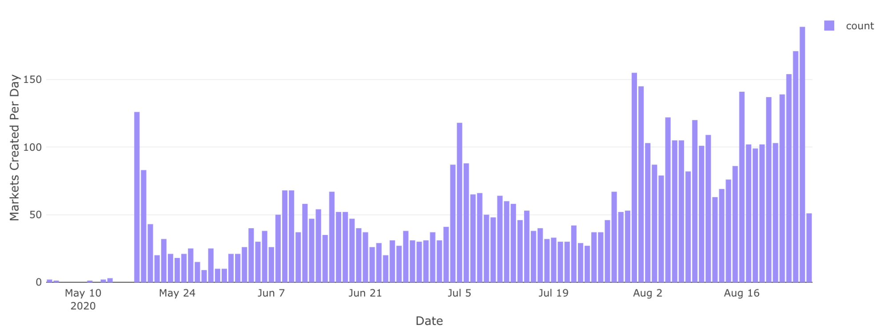

As the Ethereum ecosystem continues to evolve, we continue to see exponential growth in the number of ERC20 tokens being issued. This maturation reflects the success of permissionless innovation, a trend we expect will only accelerate in the future: everything of value will be tokenized.

As the rate of token issuance accelerates, it has become increasingly difficult for users to filter out high quality, legitimate tokens from scams, fakes, and duplicates.  Across the space, projects are managing and maintaining rapidly growing token lists. The end result is a lot of wasted time, slow listing processes and scammed users. In addition, builders should spend their time building, not deciding which tokens are legitimate and which are scams, fakes or duplicates.

Today, we are excited to announce [Token Lists](https://tokenlists.org/), a new standard for creating lists of ERC20 tokens. This is a community-led initiative to improve discoverability and trust in ERC20 token lists in a manner that is inclusive, transparent, and decentralized.

Token Lists follow a standard JSON schema and can be hosted publicly on ENS, IPFS, and HTTPS.

The initial launch includes:

*   An ERC20 token list standard
*   A homepage and list browser at [tokenlists.org](https://tokenlists.org/)
*   A community forum at [community.tokenlists.org](https://community.tokenlists.org/)
*   Lists from [CoinMarketCap](https://coinmarketcap.com/), [Coingecko](https://www.coingecko.com/en), [Dharma](https://www.dharma.io/), [Zerion](https://zerion.io/), [Kleros TCR](https://kleros.io/), [Defiprime](https://defiprime.com/), [Compound](https://compound.finance/), [Aave](https://aave.com/), [Synthetix](https://synthetix.exchange/#/), [UMA](https://umaproject.org/), [1inch](https://1inch.exchange/#/), and [Roll](https://tryroll.com/) (and many more coming soon!)

Token Lists can be used **right now** in the [Uniswap Interface](https://app.uniswap.org/#/swap), removing the need for a default list.

<iframe width="100%" height="315" src="https://www.youtube.com/embed/pAQyBRB8Y74" frameborder="0" allow="accelerometer; autoplay; encrypted-media; gyroscope; picture-in-picture" allowfullscreen></iframe>

This is another step forward in interface decentralization. Read Uniswap Interface + IPFS to learn how the Uniswap interface is now hosted by the community in a decentralized manner.

We hope to continue iterating and improving Token Lists in collaboration with the broader community.

## Gatekeeping is Dead

In the legacy financial system, the concept of “listing” is incredibly meaningful. Gatekeepers manage lists of assets on a discretionary basis. Without listing, the utility of an asset is severely diminished. Unlisted assets often can’t be transferred, traded or used in any other capacity. For all intents and purposes, “unlisted assets” do not exist.

In the Ethereum-based decentralized financial system, the concept of “listing” loses its meaning. Anyone can create a new ERC20 token and transfer it to anyone else, and it will be publicly recorded on the Ethereum blockchain. 

Since all tokens use a standard interface, infrastructure-layer applications, such as wallets, analytics sites, and DeFi protocols (like Uniswap) can immediately recognize and interact with new ERC20 tokens from the moment they are deployed.

Adding a new ERC20 token to the Uniswap protocol is as simple as calling a public function on a permissionless and immutable smart contract. In fact, about** 100 new Uniswap V2 liquidity pools are deployed every day**, with over 6,000 pools added since it launched in May 2020.

## Decoupling Discovery + Reputation from Gatekeeping

While gatekeepers often stifle innovation, they also serve to filter out low quality assets that users don’t want or need.

As we move towards mass tokenization, this process of filtering and curation becomes more important than ever before for Ethereum-based projects. The alternative is a UX nightmare, with users having to verify the legitimacy of assets on an ad hoc basis.

As the decentralized finance movement continues to remove gatekeepers, it is imperative that new systems for discovery and reputation do not devolve into centralized gatekeeping. 

## Current Approaches

A naive approach to ERC20 token lists is automatically displaying every asset. While this is maximally decentralized, it opens up the door for phishing, scams, and presents users with way too many options.

Another naive approach is creating a decentralized governance system as a gatekeeper, with the hope that this governance system will be fairer than the gatekeepers that came before it.

Most projects opt for the easiest and most practical solution: maintaining a list supported by their own reputation. 

## Long Live Token Lists

Token Lists leverages Ethereum’s greatest strengths - its numerous high quality projects and communities, their ability to share public infrastructure, and the ease of interoperability between them.

The idea is simple - any project on Ethereum that maintains a list of ERC20 tokens hosts this list publicly following a standard JSON schema. Projects attach their reputation to lists by hosting them on a domain they control.

Some examples:

*   A list is hosted on test.cmc.eth, an ENS domain controlled by CoinMarketCap 
*   A list is hosted on Coingecko.com, which is controlled by CoinGecko
*   A list is hosted on t2crtokens.eth, which is controlled by a Kleros TCR using a decentralised governance process

Lists can also be project or category specific. For example:

*   A personal tokens list by Roll
*   A list of all Synthetix synths
*   A list of all UMA synths

Since lists are publicly hosted and follow a standard format, they can be decoupled from individual interfaces and instead be combined and shared across projects. For example, an interface could automatically display any tokens that are on at least m out of n reputable lists. Or it could display all tokens across a set of lists, but display trust scores based on the number lists an asset is on. Or it can build in a list explorer that allows any user to import the lists that they want to trust.

Another critical advantage of lists is the speed at which new assets can be discovered and used. If a new asset is released by a reputable project, the project can simply update their own list and any interface (or aggregate list maintainer) subscribed to that list can automatically import it in real time.

To help spur adoption of Token Lists and provide a high quality reference example, we have deprecated the old Uniswap interface “default list”, and replaced it with a list explorer and importing mechanism. 

We have also partnered with a number of reputable projects in the space who were excited to create and maintain lists of their own. More than 10 lists are already available on [tokenlists.org](https://tokenlists.org/) and more are in progress.

## Get involved with Token Lists

We imagine Token Lists emerging as foundational infrastructure for the Ethereum ecosystem to self-govern reputation around tokens and are excited to see lists used in other projects.

To get involved:

*   [Create a token list](https://github.com/uniswap/token-lists#authoring-token-lists)
*   [Discuss token lists in the community forum](https://community.tokenlists.org/)
*   Integrate Token Lists into your project
*   Develop tooling or dashboards or help improve the dashboard we created
*   Generate hype on crypto twitter

Special thanks to Denis Nazarov and Jesse Walden for their help on this blogpost.
