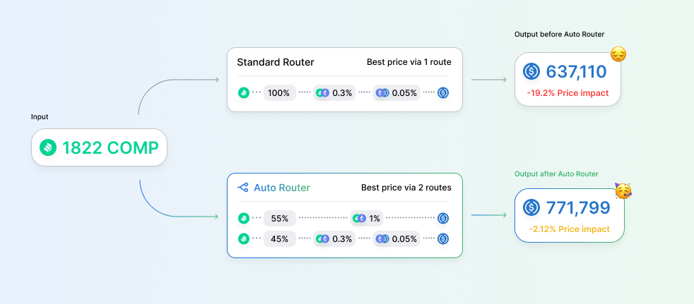

Today we’re excited to announce the release of our new Auto Router! The Auto Router uses an advanced smart order routing algorithm to find better prices for traders in the [Uniswap app](http://app.uniswap.org). The following techniques are employed.

* **Split routes** to deliver a better price across multiple execution paths
* **Explore more liquidity** to discover new routes and execute large trades that were previously implausible in the Uniswap App router.
* **Evaluate gas costs** to ensure every added step is net positive for your trade

Lastly, if there is a better trade available on Uniswap v2 after accounting for gas costs, the Auto Router will automatically switch to v2.

# Split Routes

One way that the Auto Router achieves better prices is by splitting trades across multiple pools. In the legacy router, a trade was always executed through a single route. Now, your trade can be split across up to seven paths to take advantage of liquidity depth in different pools. In the example below, the trader saves $134,689 by splitting the route on a COMP:USDC trade. This is more than enough to cover the additional gas cost of the second route.

_The Auto Router optimizes your price by splitting the route across multiple pools._

# Explore more liquidity

The Auto Router enables efficient execution on large trades that were previously implausible with standard routing. For example, without the Auto Router an 80M USDT:USDC swap would incur a price impact of -62.9%. With the Auto Router, the same trade can be executed with a price impact as low as -0.749%.

_The Auto Router explores liquidity at greater depth than the standard router which previously ran out of gas._

# Evaluate Gas Costs

The Auto Router is sensitive to the gas price market. With today’s launch, smaller trades will execute more efficiently by minimizing the number of gas-intensive hops to reach the output token. For example, this ETH:LINK trade saves $8.16 in gas fees to deliver a 10% better price by removing a hop from the route.

_The Auto Router is aware of gas costs and will only take an extra hop if it yields a better effective price._

# Auto Router Interface

The Auto Router is now live and enabled by default for all users in the Uniswap App. You can hover over the Auto Router icon to peak into your trade route. 

You may disable the Auto Router in settings if you wish to avoid a network call to the Uniswap Labs server.

# Open Source Code

We are deeply committed to decentralized and open-source financial infrastructure. In that spirit, we have published the full Auto Router source code under the GPL license.

* [@uniswap/routing-api](https://github.com/Uniswap/routing-api): Wraps and deploys the smart-order-router as a hosted service.
* [@uniswap/smart-order-router](https://github.com/Uniswap/smart-order-router): Contains the logic for finding the most efficient way to swap token A for token B, considering split swaps across multiple routes and gas costs.

# Developers

The Uniswap App fetches quotes from an instance of the Auto Router hosted by Uniswap Labs. Local developers and IPFS builds will be able to call the Auto Router API up to a modest request limit. The app will fallback to legacy routing when the request limit is exceeded, and in any situation where the Auto Router fails to return a quote. If your app needs to handle a higher load, you are welcome to deploy your own instance of the Auto Router from the open source code.

We will host a Twitch livestream over the coming weeks to walk through the Auto Router codebase and teach developers how to work with it.

# Measuring Price Improvements

In our [analysis](https://github.com/Uniswap/uniswap-routing-api-canary/blob/main/scripts/backtest/python/main.ipynb) of 4,429 on-chain swaps from June 1, the Auto Router improves pricing on [13.97%](https://github.com/Uniswap/uniswap-routing-api-canary/blob/main/scripts/backtest/python/main.ipynb) of all trades and [36.84%](https://github.com/Uniswap/uniswap-routing-api-canary/blob/main/scripts/backtest/python/main.ipynb) of trades between the Top 10 tokens by TVL.

Benefits are spread across all trade size buckets. Many low value trades benefit from the Auto Router’s awareness of gas costs, allowing it to recommend fewer hops for better overall execution. For larger trades, price improvements are primarily driven by the Auto Router’s new route splitting capabilities.

_The Auto Router improves trades of all sizes _

# Future work

Our journey has only just begun! We will continue iteratively improving the Auto Router to unlock better trade prices for users of the Uniswap App. The next release will support splitting routes across Uniswap v2 and v3 simultaneously and we also plan to support routes on Optimistic Ethereum and Arbitrum.

Additionally, we intend to further decentralize the Auto Router for the Uniswap Community by publishing a client-side version of the Auto Router.

For now, enjoy improved prices in the Uniswap App!

---

To get involved and stay up to date:

* Join the Uniswap community [discord](https://discord.com/invite/FCfyBSbCU5)
* Follow Uniswap Labs on [Twitter](https://twitter.com/Uniswap)
* Subscribe to the Uniswap Labs [blog](https://uniswap.org/rss.xml)
* Register as a delegate on [Sybil](https://sybil.org/#/delegates/uniswap)
* Participate in Uniswap [governance](https://gov.uniswap.org/)

Uniswap Team 🦄

