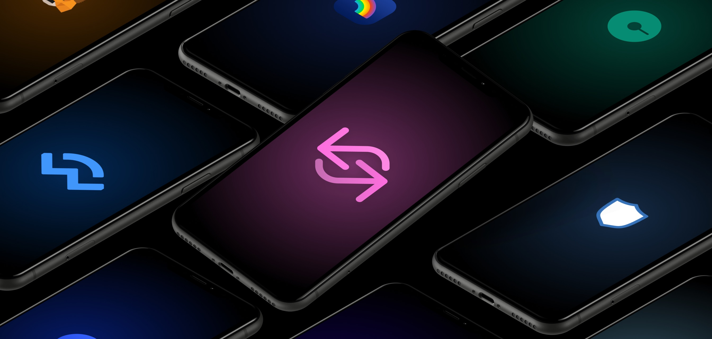
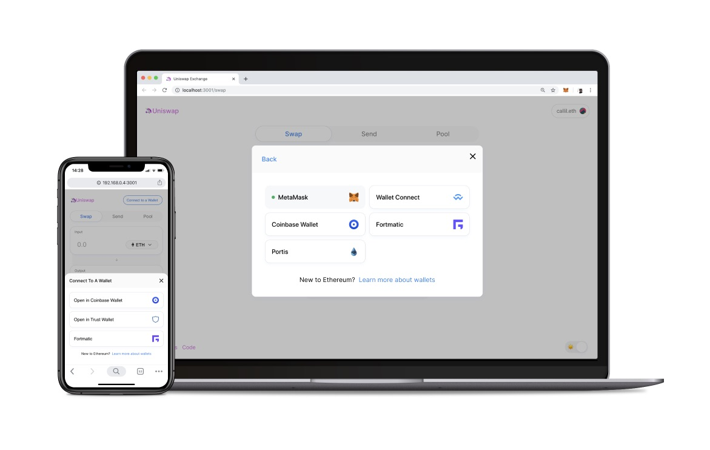

We’re improving wallet support on Uniswap.exchange. To start we’ve added support for:

- WalletConnect
- WalletLink (Coinbase Wallet)
- Portis
- Fortmatic
- Mobile deep linking for Trust Wallet

You can also now dynamically switch between wallets through the account modal, which is opened by clicking on your account at the top-right hand of the screen.

# WalletConnect

WalletConnect allows mobile wallets to connect to your desktop browser through a QR code and sign transactions. It even works on browsers such as Safari!

Adding WalletConnect support allows wallets such as Rainbow Wallet, Gnosis Safe and Argent Wallet (coming soon) to connect to Uniswap for the first time. MetaMask mobile and Trust Wallet can also be used with wallet connect.

# WalletLink

WalletLink functions similar to WalletConnect, using a QR code to connect your mobile Coinbase Wallet to any browser. It only needs to be linked once to work across all dApps that support it.

# Portis

Portis allows users to sign into their wallet with a username / password combination in a pop-up window. They support 2FA and provide a fiat on-ramp through Wyre.

# Fortmatic

Fortmatic allows users to sign into their wallet through traditional methods like email and phone in a pop-up window. They support 2FA and allow custom styling for sites that integrate.

# web3-react@6

This is all built on the new v6.0 release of the web3-react library built by our very own Noah Zinsmeister. This release features many improvements including improved connector logic and a monorepo with dynamic imports to get your bundle sizes down. This enables us to provide great UX for seamlessly switching between wallet providers.
Do you use another wallet that’s not supported yet? Let us know.

Happy Holidays from the Uniswap team!

❤
