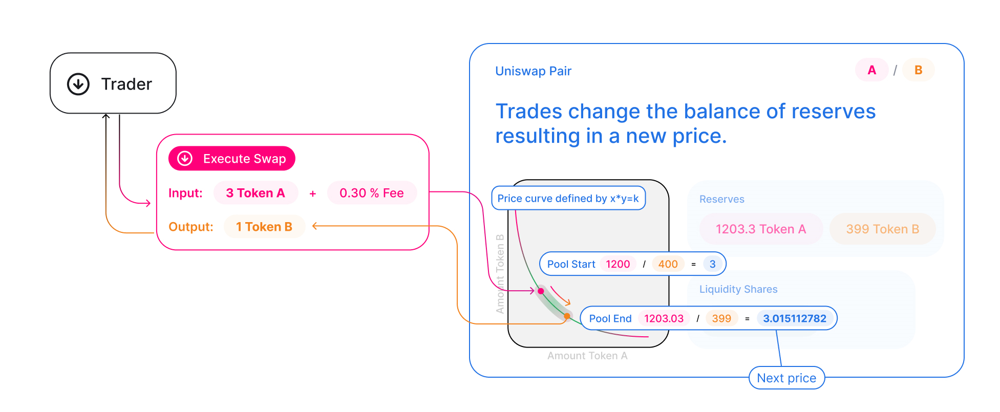

  

یونی سوآپ یک پروتکل تامین نقدینگی خودکار است که برپایه «فرمول حاصل ضرب ثابت» بنا شده است و با استفاده از قرارداد هوشمند که غیر قابل تغییر است روی شبکه بلاکچین اتریوم پیاده سازی شده است .
واضح است که یونی سوآپ نیاز به واسطه هایی که مجبوریم به آنها اعتماد کنید را از بین می برد ، عدم تمرکز ، مقاومت در برابر سانسور و امنیت را در اولویت قرار می دهد.یونی سوآپ یک نرم افزار open source و تحت مجوز GPL هستش .

هر قرار داد هوشمند یونی سوآپ ، یک استخر نقدینگی که از ذخایر دو توکن ERC-20 تشکیل شده را مدیریت می‌کند

هرکسی در یک استخر نقدینگی میتواند ، سپرده گذاری کند (نقدینگی واریز کند) و تبدیل به یک سپرده گذار شود . برای این کار باید دو توکن ERC-20 با ارزش یکسان(pair) تامین بکنه و در عوض نشان سرمایه گذاری اون استخر (lp token)رو دریافت کنه . نشان سرمایه گذاری نشان دهنده مقدار سهم شما از کل موجودی آن استخر نقدینگی هستش و شما می‌توانید برای بازخرید (پس گرفتن ) توکن هایی که تامین کرده بودید نشان سرمایه گذاری را به قرار داد هوشمند بر گردونید و توکن های اولیه خود را دریافت کنید و این کار رو هر وقت که بخوایید میتونید انجام بدید  

هر  pair (جفت توکن با ارزش برابر) در قرار داد هوشمند آماده هستند که یکی از توکن های موجود در این pair رو در برابر دیگری معامله کند تا زمانی که شرایط  «فرمول حاصل ضرب ثابت» برقرار باشد.در ساده ترین شکل ارائه این فرمول x * y = k هستش که در آن k عددی ثابت هست و نباید تغییر کند پس اگر مقدار x زیاد شود باید مقدار y کم شود و بلعکس تا مقدار k ثابت باشد. با توجه با این فرمول می‌توان دریافت که در مقادیر بزرگتر نرخ تبدیل پایینتری نسبت مقادیر کوچک تر داریم 

برای درک بهتر پیشنهاد میشه قسمت چهارم از فصل چهارم پادکست شیر یا خط رو گوش کنید (یا از یوتیوب ببینید : https://www.youtube.com/watch?v=sApDqbBQVvY)

در عمل پروتکل یونی سوآپ 0.30 درصد کارمزد برای هر تراکنش در نظر می‌گیره که به ذخایر استخر نقدینگی اضافه میشه . در نتیجه باعث میشه که k هر فرد به ازای هر تراکنش افزایش پیدا کنه اما این موقع تحویل نشان های سرمایه گذاری در نظر گرفته می‌شود . موقع تحویل نشان های سرمایه گذاری برای دریافت توکن های اصلی تابعی مقدار سهم شما را از مقدار کل فی های جمع شده محاسبه می‌کند و سهم شما از مقادیر جمع شده به علاوه توکن های خودتان به شما بر می‌گرداند

از آنجایی که قیمت در پروتکل یونی سواپ از طریق نرخ تبدیل توکن های یک pair تعیین می‌شود ، قیمت در یونی سواپ فقط از طریق معامله کردن (trade) تغییر می‌کند . اختلاف قیمت در یونی سواپ و بازار های دیگر (مثل صرافی های متمرکز ) امکان آربیتراژ به وجود می‌اورد و آربیتراژ گیر ها به سراغ یونی سواپ می‌آیند و این مکانیزم باعث میشه که قیمت توکن ها در یونی سواپ همیشه با توجه به تغییرات قیمت جهانی تغییر بکند

# مطالعه بیشتر
توضیح چگونگی انجام مبادله :
https://github.com/irnb/uniswap-org/blob/master/src/pages/docs/v2/02-core-concepts/01-swaps.md
توضیح استخر های نقدینگی :
https://github.com/irnb/uniswap-org/blob/master/src/pages/docs/v2/02-core-concepts/02-pools.md

در نهایت پروتکل یونی سواپ چیزی بیشتر از کد های یک قرارداد هوشمند که بر روی شبکه اتریوم اجرا می‌شوند بیشتر نیست برای فهمیدن چگونگی کار کردن قرار داد هوشمند آن لینک زیر مفید هست :
https://github.com/irnb/uniswap-org/blob/master/src/pages/docs/v2/01-protocol-overview/03-smart-contracts.md

