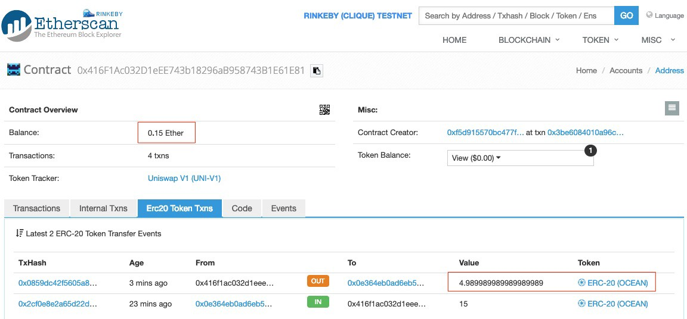

We are ready to swap tokens using Uniswap right now!

In our first testing, ETH is sent to the exchange contract, which will be automatically converted into ERC20 tokens. The Javascript source file is here.

Etherscan shows 0.05 ETH has been deposited into the exchange contract and converted into 5 ERC20 tokens, which are transferred to the buyer’s wallet.

In the second testing, we can swap between two ERC20 tokens. Here, we use our deployed ERC20 token and LINK token as an example.

Uniswap withdraws 0.0015 our ERC20 token and deposits 10 LINK tokens in the wallet.

