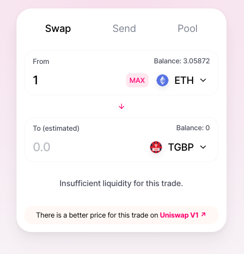

## Overview

The Uniswap interface allows users to interact with the Uniswap smart contracts and perform key actions like swapping tokens, adding liquidity, removing liquidity, and more. To use the Uniswap interface, users must connect through any of the supported wallet options which are described below. The interface is open sourced and source code can be found below.

#### Links

[Interface](https://uniswap.exchange/swap)

[Interface Source Code](https://github.com/Uniswap/uniswap-frontend)

## Making Swaps

#### Connecting a Wallet

Users must connect with a supported wallet before making transactions. To connect a wallet, a user should click one of the "connect" buttons in the top corner or the main section of the interface. Next, they can select one of the supported wallet options from the list (different on mobile vs desktop). This will establish a web3 connection in the browser allowing the user to structure and approve transactions. To learn more about wallets [see here](https://ethereum.org/wallets/).

#### Selecting Tokens

To make a swap a user must select an input token (token to sell), and an output token (token to buy). Using the dropdown users can select from a list of tokens.

In this token selection view a user can see their live token balances. Users can search in the search box by token name, symbol or token address.

#### Importing Custom Tokens

Users have the ability to import any valid token into the interface. Users can do this by pasting the token address in the search box. If the token is a valid token the search area will populate with token information and users can import that token to swap. This token will be saved in browser local storage and persist across sessions.

#### Entering Amounts

If there is a valid route between the two selected tokens the user can continue to input amounts for their trade. The rate information for the selected tokens will automatically be fetched. The user can enter an amount in the 'from' field or the 'to' field. The other token amount will automatically update based on which field was edited by the user, and based on the pricing information that has been fetched from the Uniswap contracts.

#### Pricing, Routing, and Exceptions

In the background the interface will fetch rates from the Uniswap V2 and V1 contracts. Within V2, the interface will find the route between pairs that gives the user the best price for their desired trade. To learn more about routing and trade structure see here.

##### V2 vs V1 rates

If there is a better price for the desired trade on Uniswap V1, a message will appear and link to the same trade on the legacy V1 interface. To execute the trade on Uniswap V1, click the link and use the legacy UI to complete the trade.

##### Liquidity Exceptions

In some cases there will not be enough liquidity to support a desired trade. In this case the user will see an error message, and will not be able to submit the trade. In this situation a user may try structuring the trade with a smaller output amount, or work to get liquidity added to the relevant pairs.

#### Approvals

Users making swaps will need to approve the router contract before selling any tokens (besides ETH). To learn more about the Uniswap router contracts and how they interact with the Uniswap V2 core contracts see here.

If an approval is needed, the interface will update and prompt the user to submit an approval transaction.

The interface will automatically detect when an approval is confirmed and allow the user to submit the trade for confirmation.

#### Advanced Settings and Considerations

##### Advanced settings

After selecting tokens and input amounts a user will see an option to view advanced settings below the trade.

Users can select a custom slippage tolerance for a trade. The slippage tolerance limit will cause the transaction to fail if the price changes unfavorably by the tolerance or more. Users can use this setting to create more or less strict bounds for their trade. The default value is 0.5%.

Users can also set a custom deadline for their trade. If the trade takes longer than the selected time it will fail. The default duration is 20 minutes.

##### Advanced amounts and warnings

Users can see additional information about the amounts they're trading as well. The interface automatically calculates price impact, which is the difference between market price and estimated price due to trade size. Users will see a warning displayed if the price impact is high.

If a user has specified an specific input amount, they can now see the minimum amount of output token they will receive. If they have specified a specific output amount, they will see a maximum amount of input token that can be sold.

#### Confirming and Submitting

The last step to execute a swap through the interface is to click swap and review information in the confirmation modal. This view gives users a summary of the trade before actually submitting a transaction to their connected wallet for approval. Users can click 'confirm swap' and confirm the transaction in the UI of whatever wallet they have connected. Once the user approves the transaction a user can click on pending transactions in the top right and follow the links for more information on Etherscan.
