## Overview

The Uniswap interface allows users to add and remove liquidity on Uniswap V2 pairs. After connecting with one of the supported wallet options, users can also see and manage their current positions. Users can also create new pools through the interface.

The liquidity provider section of the interface can be found under the 'pool' tab here: https://uniswap.exchange/pool.

## Joining A Pool

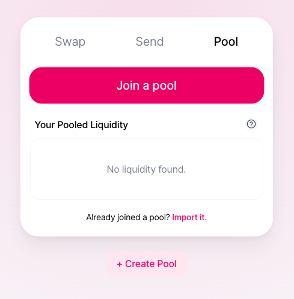

To join a new pool, users can navigate to the Pool section of the interface. To join a pool a user must have enough of the two tokens in the pool to deposit at the existing rate. To start, users can click the 'Join a pool' button. A modal will display a preset list of pools they can join.

#### Selecting a Pool

Pairs are listed with two token symbols for the tokens that make up the pair. To search for a pool users can type two token symbols separated by a '/', or they can paste the address of a specific pool.

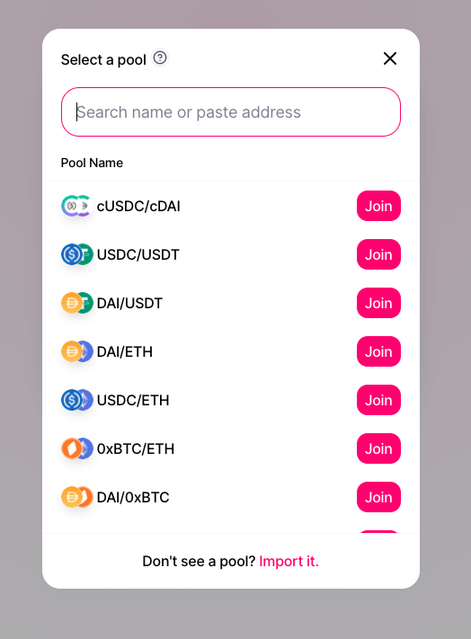

If a user can't find a pool they may need to manually import the pool. To do this they can click on the 'import it' button on the bottom and follow the import flow. On this screen they can search for the two tokens that make up the pool. If the pool exists they will be prompted to add liquidity to the pool. If the pool doesn't exist they will be prompted to create the pool as the first liquidity provider.

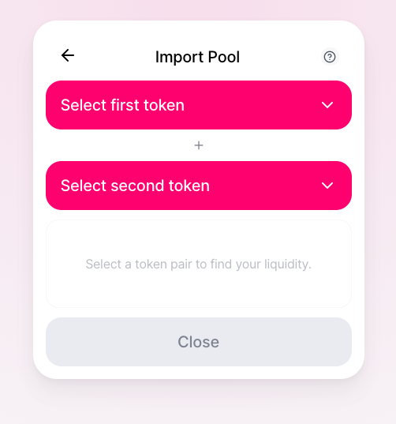

#### Inputting Amounts

After finding the desired pool, a user can continue by selecting the amount of liquidity they want to provide. They can enter an amount of either token and the other amount will be populated automatically based on the current rate between tokens. (If the pool doesn't exist yet the user will need to input both amounts, see [Creating A New Pool]() for more.)

Users can view the current rates that they'll be adding liquidity at in the details section below the inputs. They will also see a label called 'Share of Pool'. This percent represents how much of the entire pool they will own based on the amounts they've inputted. (If you are the first provider you will own 100% for example).

#### Approvals

Users will need to approve the Uniswap router before adding liquidity. To learn more about the router contract and how it interacts with the core Uniswap contracts see [here](). To do this a user can click the 'Approve' button that automatically displays if an approval is needed. An approval is needed for any token beside ETH. Once all approvals have been made and confirmed the UI will update automatically and allow the user to confirm the transaction to add liquidity.

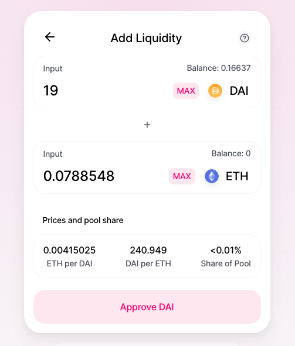

#### Confirming Transaction

To complete the add (or remove) users can click the main button on the interface which will bring up a confirmation modal. This view gives users a summary of the transaction they're about to submit. On the top it displays how many pool tokens the user will receive in exchange for the liquidity provided. In the bottom section it displays information on how much of each token will be supplied, with rate details as well.

To finalize the transaction click the confirm button and approve the transaction in the UI of their connected wallet.
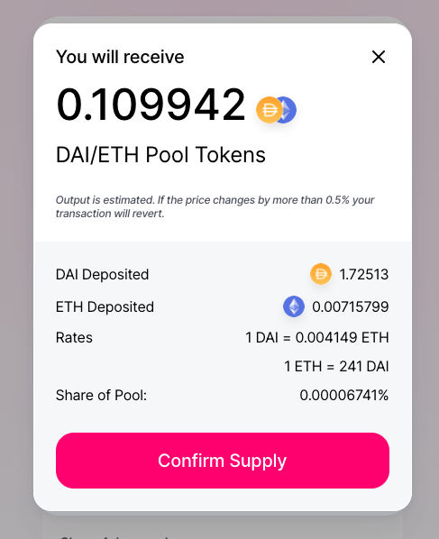

## Viewing Existing Positions

Users can view and manage their existing liquidity positions by connecting to the interface and navigating to the 'pool' tab. They will see a list of pools they have joined, and can manage the pools by clicking the dropdowns.

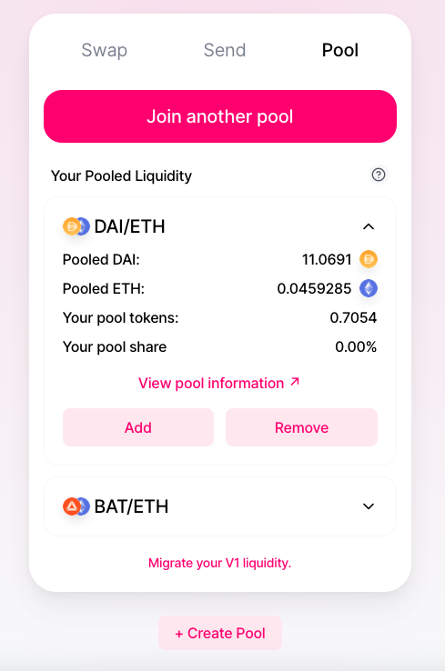

## Importing Liquidity

Sometimes users have liquidity in pools that don’t appear in the UI by default. If a user doesn’t see their liquidity listed in the main ‘Pool’ page they can manually import it.

Users can import pools they've already joined by clicking the 'import it' link on the bottom of the Pool tab. As described above, they can find a pool by following the import flow and selecting the two tokens that make up the pool. If a user does have liquidity in that pool it will populate in the main section of the 'Pool' tab.

## Creating a New Pool

Users can also use the interface to create new pools. To do this they can click the 'create pool' button on the bottom of the 'Pool' page.

#### Selecting Tokens

On this page users must select the two tokens that will make up the pair. If the two selected tokens already exist as a pool a link will appear to that existing pool.

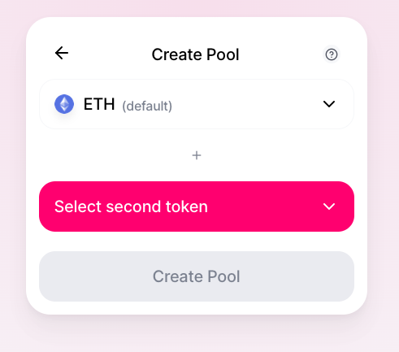

ETH is selected by default as one of the tokens, but users have the option to select any two tokens they want. Common bases will be shown in the token modal. These tokens are most commonly used but again, not required. The order of the tokens does not matter, and after both have been selected a user can continue to set initial rates for the new pool.

#### Setting initial rates

As the first liquidity provider a user is responsible for setting the initial rate for the pool. To set the rate the user can set the desired amount to provide for each token in the pair respectively. This ratio will be displayed in the details section of the page, and will be used as the initial rate within the pool. To learn more about pools and why this initial rate is important to set correctly see [here]().

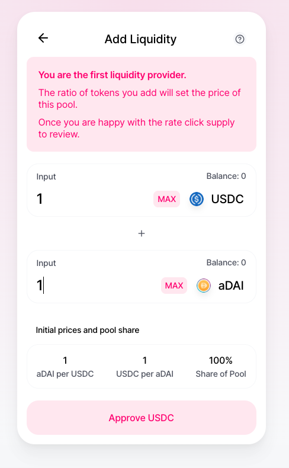

#### Creating the Pool

Once the user is happy with the initial rates they may need to approve the tokens being supplied (described above under approvals). After both tokens have been approved the user can click confirm, review information about the transaction, and submit to their connected wallet for final approval.

## Adding To Existing Liquidity

To add more liquidity to an existing position a user can click into their position on the main 'Pool' page and then click 'add'.

## Removing Liquidity

To remove liquidity from an existing position a user can click into their position on the main 'Pool' page and click remove.

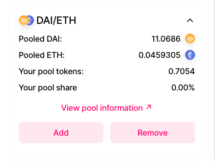

#### Selecting Removal Amount

There are two views to select how much liquidity to remove: a simple view and a detailed view.

In the simple view a user can select the amount to remove by percentage. 100% will remove all the liquidity a user has supplied for that pair.

In the advanced view users can input specific amounts for removal. They have the option to input a specific amount of LP tokens to deposit, or a specific amount of either token to remove. Based on which field is edited the other fields will populate automatically.

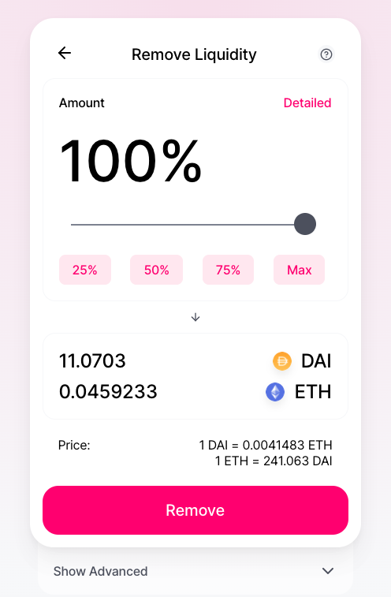

#### Approvals and Confirmation

On removal there is only one prerequisite approval before the transaction can be submitted. After clicking 'remove' users will be prompted to make this approval in the modal. After completing this users can proceed to submit their removal.

The confirmation modal provides users with a summary of the transaction. It shows the amount of each token in the pair that will be removed, and gives the amount of LP tokens that will be burned as well. There is also additional information about the current price. To finalize the removal a user can click confirm and approve the transaction in the UI of their connected wallet.

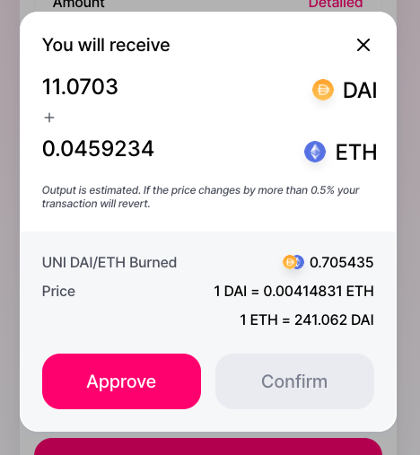

## Advanced Details

On both add and remove pages users can click 'show advanced' to define custom settings for their transaction. Slippage tolerance defines a limit to how much the price on the pair can change before the transaction is reverted. The deadline defines how long after submission the transaction will remain valid (if the deadline is reached before the transaction is processed it will revert). The user can change these settings based on their preferences for adding and removing. For more detailed information on slippage and price impact see [here]().

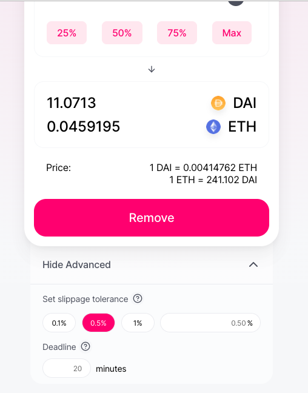
