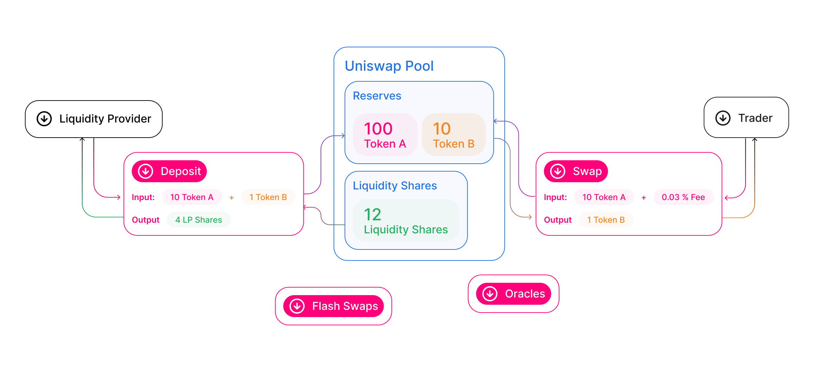

Each Uniswap liquidity pool is a trading venue for a pair of ERC20 tokens. When a pool contract is created, its balances of each token are 0; in order for the pool to begin facilitating trades, someone must seed it with an initial deposit of each token. This first liquidity provider is the one who sets the initial price of the pool. They are incentivized to deposit an equal _value_ of both tokens into the pool. To see why, consider the case where the first liquidity provider deposits tokens at a ratio different from the current market rate. This immediately creates a profitable arbitrage opportunity, which is likely to be taken by an external party.

When other liquidity providers add to an existing pool, they must deposit pair tokens proportional to the current price. If they don’t, the liquidity they added is at risk of being arbitraged as well. If they believe the current price is not correct, they make arbitrage it to the level they desire, and add liquidity at that price.

Whenever liquidity is deposited into a pool, special tokens known as _liquidity tokens_ are minted to the provider’s address, in proportion to how much liquidity they contributed to the pool. These tokens are a representation of a liquidity provider’s contribution to a pool. Whenever a trade occurs, the 0.3% fee which is levied is distributed _pro-rata_ to all LPs in the pool at the moment of the trade. To receive the underlying liquidity back, plus any fees that were accrued while their liquidity was locked, LPs must burn their liquidity tokens.

Liquidity providers can also choose to sell, transfer, or otherwise use their liquidity tokens in any way they see fit.
