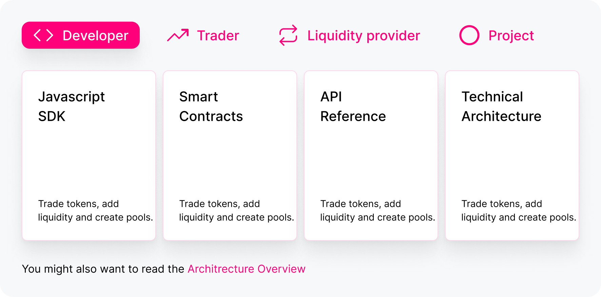

Uniswap is an on-chain marketplace for swapping ERC-20 tokens built on Ethereum.

It eliminates trusted intermediaries and unnecessary forms of rent extraction, allowing for fast, efficient exchange.

Under the hood, Uniswap is a protocol-powered token exchange marketplace, operated by a community of participants using smart contracts running autonomously on Ethereum.

Uniswap doesn't have external dependencies and doesn't rely on central operators.

This portal is meant to introduce end-users to using Uniswap, developers to building on it, and liquidity providers to make markets.

The portal also aims to explain how Uniswap works practically and how it is implemented.

## Quickstart

## How Uniswap works

Uniswap's core functionality enables users to swap between any ERC-20 tokens on Ethereum.

[Token swaps](/token-swaps)

Uniswap uses a novel mechanism called a **liquidity pool** to enable exchange between two tokens.

[Liquidity pools](/liquidity-pools)

In practice, a liquidity pool is an instance of a Uniswap smart contract template that enforces certain rules about the balance of the two tokens being deposited in the contract.

These rules, known as an **automated market maker formula**, enable Uniswap to always quote a price to an end-user and provide liquidity, as well as incentivize arbitrageurs to keep prices on Uniswap in line with broader markets.

[Anatomy of a pool](/liquidity-pools)

Because a liquidity pool is just a smart contract, anyone using Ethereum can register a liquidity pool between any two tokens using the Uniswap factory contract.

There are no listing fees and no permission necessary to add a token to Uniswap.

[Creating a pool](/liquidity-pools)

Uniswap democratizes participation in market making for liquidity providers. While traditional exchanges typically present high barriers to entry and technical complexity for market makers, Uniswap makes market making as simple as sending tokens to a liquidity pools.

[Providing liquidity](/liquidity-pools)

Because Uniswap liquidity pools are instances of smart contracts running on Ethereum, it is easy for developers to interact with the code and utilize or extend their functionality.

Developers can integrate token swap functionality, or any other Uniswap features, into to their applications or smart contracts in the same way they can interact with all code running on Ethereum.

[Interface development](/liquidity-pools)

Uniswap is permissionless and open source. It has no central operators and is sustained by a community of participants. There is no central token or platform fee. No special treatment is given to early investors, adopters, or developers.
