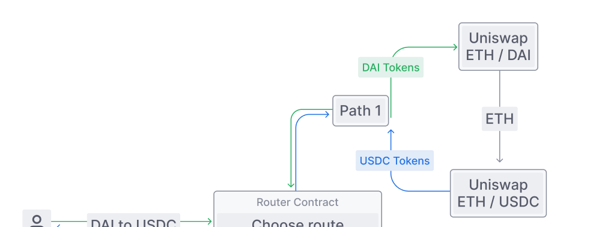

The pages that follow contain comprehensive documentation of the Uniswap V2 ecosystem. Briefly, Uniswap is a protocol for exchanging ERC-20 tokens on Ethereum. It eliminates trusted intermediaries and unnecessary forms of rent extraction, allowing for fast, efficient trading. Where it makes tradeoffs decentralization, censorship resistance, and security are prioritized. Uniswap is open-source software licensed under GPL.

You might want to check out the <Link to="/faq">FAQ</Link> first before diving in.

## Getting started

<Wizard />

## New to Uniswap?

<InlineBoxLink title="FAQ" to={''}>

</InlineBoxLink>

<InlineBoxLink title="How Uniswap works" to={''}>

</InlineBoxLink>

## Tutorials
